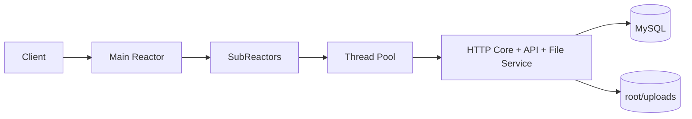
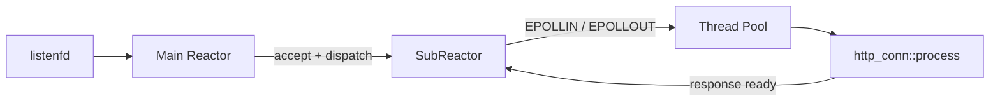
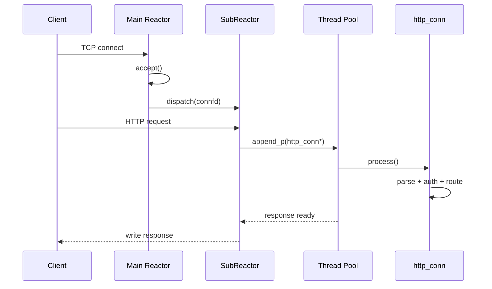
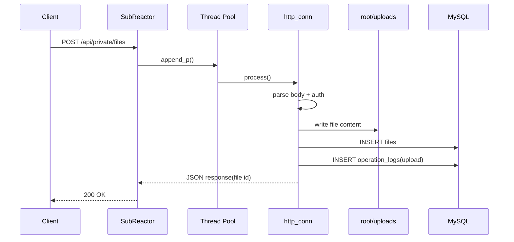

# Atlas WebServer


Atlas WebServer 是一个基于 C++、Linux `epoll` 和 MySQL 的工程化 Web 服务，提供完整的 HTTP 服务栈、鉴权能力、文件管理能力、操作审计、容器化部署、脚本化验证和基准测试材料。

## 项目简介

Atlas WebServer 运行于 Linux 网络编程模型之上，核心采用 `Main Reactor + Multi-SubReactor + Dynamic Thread Pool` 结构，支持 HTTP/1.1、Keep-Alive、静态资源、JSON API、可选 HTTPS、Bearer Token 鉴权、文件上传下载、公开分享与操作日志记录。

项目当前已经具备以下交付要素：

- 完整的服务端并发处理模型
- 基于 MySQL 的用户、会话、文件元数据和操作日志持久化
- 面向页面与 API 的统一访问入口
- Docker Compose 部署方式
- Smoke Test 与 Benchmark 脚本
- 架构图、时序图、文件模块说明和发布说明

## 核心能力

- 并发模型：`Main Reactor + Multi-SubReactor + Dynamic Thread Pool`
- 协议能力：HTTP/1.1、Keep-Alive、静态资源、JSON API、可选 HTTPS
- 鉴权能力：Bearer Token、会话持久化、私有接口访问控制
- 文件能力：上传、列表、下载、删除、公开可见性切换、公开下载
- 审计能力：登录、登出、上传、下载、删除、公开下载等行为记录
- 工程能力：配置文件、环境变量覆盖、容器部署、健康检查、冒烟测试、性能压测

## 系统架构



系统运行时由接入层、连接事件层、线程池执行层、HTTP 处理层、数据库层、文件存储层和日志层组成。主线程负责监听与分发，新连接被轮询分配给不同的 SubReactor，读写事件再被投递到线程池进行解析、鉴权、路由和业务处理。

## 启动流程

启动阶段主要完成以下初始化动作：

- 读取 `server.conf`
- 读取环境变量并覆盖配置项
- 初始化日志系统
- 初始化 TLS 上下文
- 初始化 MySQL 连接池
- 预加载用户数据
- 初始化动态线程池
- 创建监听 socket 与主 `epoll`
- 创建 SubReactor 与事件循环

## 并发模型



- 主 Reactor 只处理 `listenfd`
- 新连接通过轮询分发到不同 SubReactor
- SubReactor 维护连接读写事件和超时堆
- 业务处理统一交给线程池，避免 Reactor 线程执行耗时逻辑
- SubReactor 在收到 `EPOLLIN` 后将连接对象投递给线程池
- 工作线程通过 `connectionRAII` 临时获取数据库连接
- `http_conn::process()` 完成请求解析、鉴权、路由、数据库访问和响应拼装
- 每次 I/O 后刷新连接活跃时间，SubReactor 周期性扫描最小堆回收空闲连接

## 代码结构

```text
.
|-- main.cpp
|-- webserver.cpp
|-- server.conf
|-- http/
|   |-- core/
|   |-- api/
|   `-- files/
|-- root/
|   |-- *.html
|   `-- uploads/
|-- docker/
|   `-- mysql/init.sql
|-- scripts/
|   |-- run_smoke_suite.sh
|   |-- test_auth.sh
|   |-- test_private_api.sh
|   `-- test_files.sh
`-- docs/
```

关键目录说明：

- `http/core/`：HTTP 解析、路由、读写与响应封装
- `http/api/`：认证、会话与操作日志
- `http/files/`：文件上传、下载、列表与元数据管理
- `threadpool/`、`timer/`、`CGImysql/`：线程池、超时管理与数据库连接池
- `root/`：静态页面资源和上传目录
- `docs/`：架构、接口、性能和时序等补充文档

## 快速开始

### 使用 Docker Compose

适合本地联调和快速验证。

```bash
docker compose up -d --build
curl -i http://127.0.0.1:9006/healthz
```

默认入口：

- Web：`http://127.0.0.1:9006`
- MySQL：`127.0.0.1:3307`

停止服务：

```bash
docker compose down
```

### 本地编译运行

环境要求：

- Linux 或兼容的容器环境
- `g++`
- `make`
- `libmysqlclient`
- `OpenSSL`
- 可访问的 MySQL 8 实例

编译：

```bash
make server
```

运行前通过环境变量注入数据库配置：

```bash
export TWS_DB_HOST=127.0.0.1
export TWS_DB_PORT=3306
export TWS_DB_USER=root
export TWS_DB_PASSWORD=root
export TWS_DB_NAME=qgydb
./server
```

## 配置说明

默认配置文件为 [server.conf](server.conf)，环境变量优先级高于配置文件。

| 配置项 | 默认值 | 说明 |
| --- | --- | --- |
| `port` / `TWS_PORT` | `9006` | 服务监听端口 |
| `log_write` / `TWS_LOG_WRITE` | `1` | 日志模式，`0` 为同步，`1` 为异步 |
| `thread_num` / `TWS_THREAD_NUM` | `8` | 工作线程数 |
| `sql_num` / `TWS_SQL_NUM` | `8` | MySQL 连接池大小 |
| `conn_timeout` / `TWS_CONN_TIMEOUT` | `15` | 空闲连接超时秒数 |
| `https_enable` / `TWS_HTTPS_ENABLE` | `0` | 是否启用 HTTPS |
| `https_cert_file` / `TWS_HTTPS_CERT_FILE` | `./certs/server.crt` | 证书路径 |
| `https_key_file` / `TWS_HTTPS_KEY_FILE` | `./certs/server.key` | 私钥路径 |
| `db_host` / `TWS_DB_HOST` | `127.0.0.1` | 数据库主机 |
| `db_port` / `TWS_DB_PORT` | `3306` | 数据库端口 |
| `db_user` / `TWS_DB_USER` | `root` | 数据库用户名 |
| `db_password` / `TWS_DB_PASSWORD` | 空 | 数据库密码 |
| `db_name` / `TWS_DB_NAME` | `qgydb` | 数据库名 |
| `threadpool_max_threads` / `TWS_THREADPOOL_MAX_THREADS` | `16` | 线程池最大线程数 |
| `threadpool_idle_timeout` / `TWS_THREADPOOL_IDLE_TIMEOUT` | `30` | 线程池空闲线程回收秒数 |
| `mysql_idle_timeout` / `TWS_MYSQL_IDLE_TIMEOUT` | `60` | MySQL 连接空闲回收秒数 |
| `pid_file` / `TWS_PID_FILE` | `./atlas-webserver.pid` | PID 文件路径 |

## API 概览

### 通用约定

- Base URL：`http://127.0.0.1:9006`
- JSON 接口默认使用 `application/json`
- 认证方式：`Authorization: Bearer <token>`
- 成功响应通常返回 `{"code":0,...}`
- 错误响应通常返回 `{"code":<http_status>,"message":"..."}`

### 接口分组

- 公共接口：`GET /healthz`、`GET /`、`POST /api/register`、`POST /api/login`
- 私有接口：`GET /api/private/ping`、`POST /api/private/logout`、`GET /api/private/operations`、`DELETE /api/private/operations/:id`
- 文件接口：`GET /api/private/files`、`POST /api/private/files`、`GET /api/private/files/:id/download`、`DELETE /api/private/files/:id`、`POST /api/private/files/:id/visibility`
- 公开文件：`GET /api/files/public`、`GET /api/files/public/:id`、`GET /api/files/public/:id/download`
- 页面入口：`/index.html`、`/login.html`、`/register.html`、`/welcome.html`、`/files.html`、`/share.html`

### 请求与响应要点

- 登录成功后返回 Bearer Token 与过期时间
- 上传接口当前主路径使用 JSON，请求体支持 `content_base64`
- 上传大小限制为 `64 KB`
- 文件下载返回文件流，并附带 `Content-Disposition: attachment`
- 操作日志和文件列表默认返回最近 `50` 条记录

完整接口说明、字段示例和典型响应见 [docs/api.md](docs/api.md)。

### 常见错误码

- `400 Bad Request`：请求字段缺失或格式非法
- `401 Unauthorized`：缺失或无效 Token，或登录失败
- `403 Forbidden`：尝试访问无权限资源
- `404 Not Found`：目标资源不存在
- `413 Payload Too Large`：上传内容超过大小限制
- `500 Internal Server Error`：数据库或文件系统操作失败

## 文件业务说明

- 数据模型：`user`、`user_sessions`、`files`、`operation_logs`
- 权限控制：`/api/private/*` 统一走 Bearer Token，文件读写按资源归属校验，公开文件支持匿名下载
- 安全策略：密码采用 `SHA-256(salt + password)`，登录态持久化到 `user_sessions`
- 存储方式：文件内容写入 `root/uploads/`，元数据和审计信息写入 MySQL
- 页面入口：登录后进入欢迎页，再跳转到媒体页或文件管理页

文件模块的实现细节见 [docs/file-module.md](docs/file-module.md)。

## 请求时序

### 通用请求时序



### 文件上传请求时序



### 关键说明

- 主 Reactor 只负责接入，不承担业务执行
- SubReactor 负责连接级读写事件与超时管理
- 线程池负责业务解析和数据库访问
- `http_conn` 串联了解析、鉴权、路由、数据库操作和响应拼装
- 文件服务采用“文件内容落磁盘、元数据与审计落 MySQL”的设计

## 测试验证

### 冒烟测试

服务启动后执行：

```bash
./scripts/run_smoke_suite.sh
```

覆盖内容：

- 注册与登录
- 私有接口鉴权
- 文件上传、列表、下载、删除

### 分项脚本

- 认证链路：`./scripts/test_auth.sh`
- 私有接口链路：`./scripts/test_private_api.sh`
- 文件链路：`./scripts/test_files.sh`
- 兼容旧入口：`./scripts/test_file_workflow.sh`

### 手工检查

```bash
curl -i http://127.0.0.1:9006/healthz
curl -i http://127.0.0.1:9006/
```

## 性能数据

当前基准测试覆盖以下场景：

- `GET /healthz`
- `GET /`
- `POST /api/login`
- `GET /api/private/ping`
- `GET /api/private/files`
- `POST /api/private/files`

代表性结果：

- `GET /healthz`：最高约 `7.5k req/s`
- `GET /api/private/ping`：最高约 `7.4k req/s`
- `GET /api/private/files`：约 `2.1k ~ 3.1k req/s`
- `POST /api/login`：写路径压力下延迟明显上升
- `POST /api/private/files`：上传链路在高并发下进入秒级延迟区间

### 压测环境

- 机器：MacBook Pro
- 操作系统：macOS Sonoma 14.6
- 部署方式：`docker compose up -d`
- 压测工具：`wrk --latency`
- Web 与 MySQL：同机 Docker Compose 容器
- HTTPS：关闭

### 压测结果分析

- 轻量读路径表现稳定：`GET /healthz` 与 `GET /api/private/ping` 在高并发下可以维持 `5k ~ 7.5k req/s`，说明连接接入、基础路由和轻量鉴权路径的开销相对可控。
- 静态资源吞吐接近轻接口：`GET /` 在 `100 ~ 1000` 并发区间维持约 `4.3k ~ 6.6k req/s`，表明静态页面返回路径不是当前主要瓶颈。
- 数据库读热点已经明显暴露：`GET /api/private/files` 的吞吐长期低于轻接口，且 `benchmark.csv` 中 MySQL 峰值 CPU 多次接近或超过 `4 ~ 5` 个核量级，说明列表查询更容易受数据库访问限制。
- 重写路径进入高延迟区间：`POST /api/login` 与 `POST /api/private/files` 在 `500` 并发附近已进入秒级延迟，上传接口平均延迟达到 `1.41s`，瓶颈更像是鉴权、写库、Base64 解码和磁盘写入的叠加成本。
- 高并发下尾延迟与错误数上升明显：多个读接口在 `500` 和 `1000` 并发时出现较多 `read/write/timeout` 错误，说明系统虽然还能维持吞吐，但稳定性和 P99 已经开始恶化。
- 日志实现值得优先优化：在同机同压测条件下，同步日志 `TWS_LOG_WRITE=0` 明显优于异步日志 `TWS_LOG_WRITE=1`，说明当前异步日志实现更像额外开销来源，而不是收益点。
- 这组数据能说明当前系统的瓶颈分布和大致性能上限，但不能单独证明主从 `Reactor` 相比单 `Reactor` 的收益，因为仓库内没有同条件的单 `Reactor` A/B 对照数据。

### 优化优先级

1. 优化日志模块实现，先消除异步日志引入的额外锁竞争与队列开销。
2. 优化 `files` 列表与登录链路的 MySQL 访问，减少数据库成为读写热点。
3. 优化上传路径中的 Base64 解码、文件落盘和写库链路，降低高并发写请求的长尾延迟。

### 压测矩阵

| 接口 | 并发 | Avg | P50 | P90 | P99 | Requests/sec | Errors |
| --- | ---: | --- | --- | --- | --- | ---: | --- |
| `/healthz` | 100 | 30.97ms | 13.35ms | 24.90ms | 710.15ms | 6898.92 | connect 0, read 0, write 0, timeout 4 |
| `/healthz` | 200 | 55.11ms | 28.14ms | 55.97ms | 848.46ms | 5016.87 | connect 0, read 1462, write 0, timeout 96 |
| `/healthz` | 500 | 101.19ms | 76.94ms | 139.49ms | 915.19ms | 4476.61 | connect 0, read 4059, write 8, timeout 214 |
| `/` | 100 | 26.04ms | 18.00ms | 30.56ms | 209.02ms | 5165.27 | none |
| `/` | 200 | 51.75ms | 42.55ms | 72.94ms | 167.11ms | 4299.95 | connect 0, read 40, write 0, timeout 0 |
| `/` | 500 | 112.57ms | 92.01ms | 147.78ms | 815.33ms | 4851.51 | connect 0, read 586, write 0, timeout 40 |
| `/api/private/ping` | 100 | 15.70ms | 14.27ms | 23.92ms | 60.52ms | 6654.09 | none |
| `/api/private/ping` | 200 | 50.88ms | 39.31ms | 73.16ms | 313.87ms | 4678.28 | connect 0, read 25, write 0, timeout 0 |
| `/api/private/ping` | 500 | 59.62ms | 50.43ms | 74.79ms | 596.27ms | 5077.29 | connect 0, read 8476, write 1345, timeout 292 |
| `/api/private/files` | 100 | 55.96ms | 37.93ms | 84.00ms | 573.09ms | 2196.76 | connect 0, read 0, write 0, timeout 3 |
| `/api/private/files` | 200 | 84.73ms | 59.10ms | 80.50ms | 892.15ms | 3103.96 | connect 0, read 37, write 0, timeout 13 |
| `/api/private/files` | 500 | 214.94ms | 211.71ms | 293.53ms | 597.87ms | 2173.21 | connect 0, read 731, write 0, timeout 60 |
| `/api/login` | 100 | 117.69ms | 100.92ms | 159.00ms | 295.95ms | 875.10 | none |
| `/api/login` | 200 | 396.85ms | 371.96ms | 536.22ms | 785.85ms | 491.31 | connect 0, read 0, write 0, timeout 5 |
| `/api/login` | 500 | 1.08s | 1.09s | 1.43s | 1.84s | 426.50 | connect 0, read 337, write 2, timeout 31 |
| `/api/private/files` `POST` | 100 | 300.48ms | 272.29ms | 382.70ms | 697.62ms | 330.92 | none |
| `/api/private/files` `POST` | 200 | 497.55ms | 484.32ms | 582.59ms | 1.03s | 394.72 | connect 0, read 38, write 0, timeout 0 |
| `/api/private/files` `POST` | 500 | 1.41s | 1.45s | 1.65s | 1.84s | 320.38 | connect 0, read 586, write 0, timeout 74 |

### 1000 并发补充

| 接口 | 并发 | Avg | P50 | P90 | P99 | Requests/sec | Errors |
| --- | ---: | --- | --- | --- | --- | ---: | --- |
| `/healthz` | 1000 | 132.18ms | 124.92ms | 157.00ms | 425.25ms | 7581.63 | connect 0, read 3577, write 0, timeout 6 |
| `/` | 1000 | 149.16ms | 139.69ms | 192.63ms | 313.45ms | 6610.76 | connect 0, read 3218, write 0, timeout 17 |
| `/api/private/ping` | 1000 | 133.55ms | 122.46ms | 173.25ms | 364.37ms | 7497.74 | connect 0, read 3489, write 0, timeout 1 |
| `/api/private/files` | 1000 | 285.23ms | 259.80ms | 410.50ms | 930.34ms | 3127.67 | connect 0, read 3145, write 40, timeout 179 |

### 压测数据文件字段

结构化性能数据记录在 [docs/benchmark.csv](docs/benchmark.csv)。

| 字段 | 说明 |
| --- | --- |
| `endpoint` | 请求路径 |
| `method` | HTTP 方法 |
| `concurrency` | `wrk` 并发连接数 |
| `duration_seconds` | 压测持续时间，单位秒 |
| `threads` | `wrk` 工作线程数 |
| `request_size_bytes` | 请求体字节数 |
| `db_hit` | 是否命中数据库，`1` 表示会访问 MySQL |
| `https` | 是否启用 HTTPS，`1` 表示启用 |
| `requests_per_sec` | 吞吐，单位 `req/s` |
| `avg_latency` | 平均延迟 |
| `p50_latency` | P50 延迟 |
| `p90_latency` | P90 延迟 |
| `p99_latency` | P99 延迟 |
| `errors` | `wrk` 输出中的错误汇总 |
| `web_cpu_peak` | `web` 容器 CPU 峰值 |
| `mysql_cpu_peak` | `mysql` 容器 CPU 峰值 |
| `source` | 原始结果来源文件或采样说明 |

## 运维说明

- `docker compose` 默认挂载 `./root/uploads`
- `mysql-data` 通过 Docker volume 持久化数据库数据
- 启用 HTTPS 时需要提前准备证书并配置 `https_cert_file` 与 `https_key_file`
- `server.conf` 支持和环境变量联合使用
- 服务支持健康检查接口 `/healthz`

## 文档索引

- [架构说明](docs/architecture.md)
- [接口文档](docs/api.md)
- [请求时序](docs/request-sequence.md)
- [文件模块](docs/file-module.md)
- [性能报告](docs/benchmark.md)
- [发布说明](RELEASE_NOTES.md)

## 许可证

[MIT License](LICENSE)
