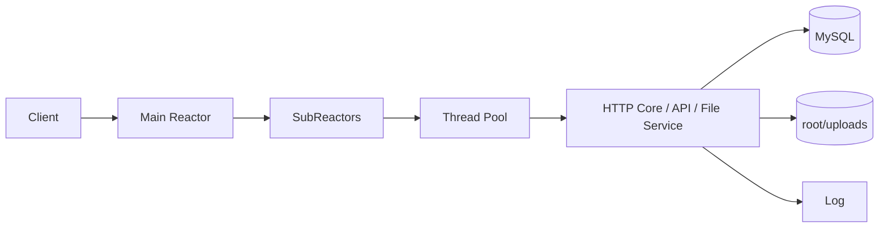

# Atlas WebServer


Atlas WebServer 是一个基于 C++、Linux `epoll` 和 MySQL 的工程化 Web 服务项目。它实现了 `Main Reactor + Multi-SubReactor + Thread Pool` 并发模型，并提供 HTTP/1.1、静态资源、JSON API、Bearer Token 鉴权、文件管理、操作审计、Docker Compose 部署、脚本化测试和性能分析材料。

## 核心看点

| 维度 | 内容 |
| --- | --- |
| 并发模型 | 主 Reactor 负责接入，多个 SubReactor 处理连接事件，线程池执行业务任务 |
| HTTP 能力 | HTTP/1.1、Keep-Alive、静态资源、JSON API、可选 HTTPS |
| 业务能力 | 注册登录、Token 会话、私有接口、文件上传/下载/删除/公开分享、操作日志 |
| 工程化 | 配置文件、环境变量覆盖、Docker Compose、健康检查、冒烟测试、`wrk` 压测、FlameGraph |
| 性能基准 | 轻读接口可达 `7k req/s` 量级，带鉴权轻接口可达 `7.4k req/s` 量级 |

## 快速开始

推荐使用 Docker Compose 启动完整环境。

```bash
docker compose up -d --build
curl -i http://127.0.0.1:9006/healthz
```

默认端口：

| 服务 | 地址 |
| --- | --- |
| Web | `http://127.0.0.1:9006` |
| MySQL | `127.0.0.1:3307` |

停止服务：

```bash
docker compose down
```

本地编译需要 Linux 环境、`g++`、`make`、`libmysqlclient`、`OpenSSL` 和可访问的 MySQL 8 实例。

```bash
make server
./server
```

## 架构



主 Reactor 监听端口并接收新连接，新连接按轮询分配给 SubReactor。SubReactor 维护连接读写事件和超时回收，业务处理由线程池执行。HTTP 层负责请求解析、路由、鉴权、数据库访问、文件操作和响应生成。

更多细节见 [架构说明](docs/architecture.md) 和 [请求时序](docs/request-sequence.md)。

## 目录结构

```text
.
|-- main.cpp                     # 程序入口
|-- webserver.cpp                # 主 Reactor 与服务启动
|-- webserver_sub_reactor.cpp    # SubReactor 事件循环
|-- config.cpp / config.h        # 配置解析
|-- server.conf                  # 默认配置
|-- http/
|   |-- core/                    # HTTP 解析、路由、IO、响应
|   |-- api/                     # 认证、会话、私有接口、操作日志
|   `-- files/                   # 文件管理与元数据
|-- CGImysql/                    # MySQL 连接池
|-- threadpool/                  # 线程池
|-- timer/                       # 连接超时管理
|-- root/                        # 静态页面与上传目录
|-- scripts/                     # 测试、压测、性能采样脚本
|-- docs/                        # 文档与结构化性能数据
`-- reports/                     # 压测和采样产物
```

## API 概览

通用约定：

| 项 | 说明 |
| --- | --- |
| Base URL | `http://127.0.0.1:9006` |
| JSON 接口 | 默认使用 `application/json` |
| 私有接口 | `Authorization: Bearer <token>` |
| 成功响应 | 通常返回 `{"code":0,...}` |
| 错误响应 | 通常返回 `{"code":<http_status>,"message":"..."}` |

主要接口：

| 分组 | 接口 |
| --- | --- |
| 健康检查 | `GET /healthz` |
| 页面入口 | `GET /`、`/login.html`、`/register.html`、`/welcome.html`、`/files.html`、`/share.html` |
| 认证 | `POST /api/register`、`POST /api/login` |
| 私有接口 | `GET /api/private/ping`、`POST /api/private/logout`、`GET /api/private/operations`、`DELETE /api/private/operations/:id` |
| 文件接口 | `GET /api/private/files`、`POST /api/private/files`、`GET /api/private/files/:id/download`、`DELETE /api/private/files/:id`、`POST /api/private/files/:id/visibility` |
| 公开文件 | `GET /api/files/public`、`GET /api/files/public/:id`、`GET /api/files/public/:id/download` |

完整字段、响应示例和错误码见 [API 文档](docs/api.md)。

## 配置

默认读取 [server.conf](server.conf)，环境变量优先级高于配置文件。常用配置如下：

| 配置 | 环境变量 | 默认值 | 说明 |
| --- | --- | --- | --- |
| `port` | `TWS_PORT` | `9006` | 服务监听端口 |
| `log_write` | `TWS_LOG_WRITE` | `1` | 日志模式，`0` 同步，`1` 异步 |
| `trig_mode` | `TWS_TRIG_MODE` | `3` | epoll 触发模式，默认 `ET/ET` |
| `thread_num` | `TWS_THREAD_NUM` | `8` | 基础工作线程数 |
| `threadpool_max_threads` | `TWS_THREADPOOL_MAX_THREADS` | `8` | 线程池最大线程数 |
| `threadpool_queue_mode` | `TWS_THREADPOOL_QUEUE_MODE` | `mutex` | 任务队列模式 |
| `sql_num` | `TWS_SQL_NUM` | `8` | MySQL 连接池大小 |
| `conn_timeout` | `TWS_CONN_TIMEOUT` | `15` | HTTP 空闲连接超时秒数 |
| `https_enable` | `TWS_HTTPS_ENABLE` | `0` | 是否启用 HTTPS |
| `db_host` | `TWS_DB_HOST` | `127.0.0.1` | 数据库主机 |
| `db_port` | `TWS_DB_PORT` | `3306` | 数据库端口 |
| `db_user` | `TWS_DB_USER` | `root` | 数据库用户名 |
| `db_password` | `TWS_DB_PASSWORD` | 空 | 数据库密码 |
| `db_name` | `TWS_DB_NAME` | `qgydb` | 数据库名 |

示例：

```bash
TWS_LOG_WRITE=0 TWS_THREADPOOL_QUEUE_MODE=mutex docker compose up -d --build
```

敏感配置建议通过环境变量注入，不要写入配置文件。

## 测试

服务启动后执行冒烟测试：

```bash
./scripts/run_smoke_suite.sh
```

常用分项脚本：

| 脚本 | 覆盖范围 |
| --- | --- |
| `./scripts/test_auth.sh` | 注册、登录、登出 |
| `./scripts/test_private_api.sh` | Bearer Token 鉴权链路 |
| `./scripts/test_files.sh` | 文件上传、列表、下载、删除 |
| `./scripts/test_file_workflow.sh` | 兼容旧入口的文件流程 |

## 性能摘要

完整性能报告、原始数据和 FlameGraph 说明见 [性能报告](docs/benchmark.md)、[benchmark.csv](docs/benchmark.csv) 和 [FlameGraph 指南](docs/perf-flamegraph.md)。

FlameGraph 原始产物是交互式 SVG，GitHub 对带脚本的 SVG 预览支持有限。仓库同时保留 PNG 预览图，适合在 GitHub 页面直接查看：

- [healthz_flamegraph.png](reports/perf/previews/healthz_flamegraph.png)
- [private_files_flamegraph.png](reports/perf/previews/private_files_flamegraph.png)

### 发布基准

测试环境：本地 MacBook Pro，Docker Compose 同机部署 Web 与 MySQL，`wrk --latency`，`TWS_LOG_WRITE=0`，`TWS_THREAD_NUM=8`，`TWS_SQL_NUM=8`，HTTPS 关闭。不同机器和容器资源下绝对数值会变化，建议跨环境对比前重新采集。

| 场景 | 并发 | Req/s | P99 | 结论 |
| --- | ---: | ---: | --- | --- |
| `GET /healthz` | 1000 | 7581.63 | 425.25ms | 轻量读路径可达 `7k req/s` 量级 |
| `GET /` | 1000 | 6610.76 | 313.45ms | 静态资源路径稳定在 `6k req/s` 量级 |
| `GET /api/private/ping` | 1000 | 7497.74 | 364.37ms | Bearer Token 鉴权轻接口可达 `7k req/s` 量级 |
| `GET /api/private/files` | 1000 | 3127.67 | 930.34ms | 文件列表受 MySQL 影响明显 |
| `POST /api/login` | 100 | 875.10 | 295.95ms | 登录是主要写路径之一 |
| `POST /api/private/files` | 100 | 330.92 | 697.62ms | 上传链路受鉴权、写库、Base64 和磁盘写入叠加影响 |

### 核心对比

日志模式对比，固定 `200` 并发：

| 接口 | 异步日志 `TWS_LOG_WRITE=1` | 同步日志 `TWS_LOG_WRITE=0` | 结果 |
| --- | ---: | ---: | --- |
| `/healthz` | 4110.59 req/s | 6793.47 req/s | 同步日志更优 |
| `/api/login` | 456.86 req/s | 633.83 req/s | 同步日志更优 |
| `/api/private/files` `GET` | 2045.00 req/s | 2780.26 req/s | 同步日志更优 |
| `/api/private/files` `POST` | 197.22 req/s | 291.28 req/s | 同步日志更优 |

`epoll` 触发模式对比，固定 `GET /api/private/ping`、`500` 并发：

| 模式 | Req/s | P99 | Errors |
| --- | ---: | --- | --- |
| `0 LT/LT` | 7604.08 | 417.95ms | `read 566, timeout 56` |
| `1 LT/ET` | 10067.04 | 412.17ms | `read 534, timeout 31` |
| `2 ET/LT` | 10399.59 | 239.96ms | `read 551, timeout 12` |
| `3 ET/ET` | 10687.70 | 255.84ms | `read 480, timeout 26` |

结论：当前实现中 `ET/ET` 是综合吞吐和延迟最合适的默认配置；同步日志在这台测试机器上明显优于异步日志。

### 非稳定快照

2026-04-23 曾以当前默认方案做过一轮 `wrk -t4 -d15s` 对比压测，部分接口相对早期基准提升明显。但该轮期间 `web` 容器发生 4 次重启并出现 `server received SIGSEGV`，因此只作为问题定位前的参考快照，不作为正式发布基准。

| 接口 | 并发 | 早期 Req/s | 快照 Req/s | 变化 |
| --- | ---: | ---: | ---: | ---: |
| `/healthz` | 500 | 4476.61 | 8368.53 | +86.9% |
| `/api/private/ping` | 500 | 5077.29 | 9620.54 | +89.5% |
| `/api/login` | 500 | 426.50 | 726.94 | +70.4% |
| `/api/private/files` `GET` | 500 | 2173.21 | 2319.48 | +6.7% |
| `/api/private/files` `POST` | 500 | 320.38 | 303.31 | -5.3% |

## 运维说明

- Docker Compose 默认挂载 `./root/uploads` 保存上传文件。
- MySQL 数据通过 Docker volume `mysql-data` 持久化。
- 健康检查接口为 `GET /healthz`。
- 启用 HTTPS 前需要准备证书，并配置 `https_cert_file` 和 `https_key_file`。
- 生产环境应通过环境变量注入数据库密码、Token 等敏感配置。

## 文档索引

| 文档 | 内容 |
| --- | --- |
| [docs/architecture.md](docs/architecture.md) | 架构与运行时模型 |
| [docs/request-sequence.md](docs/request-sequence.md) | 请求处理时序 |
| [docs/api.md](docs/api.md) | API 字段、示例和错误码 |
| [docs/file-module.md](docs/file-module.md) | 文件模块、权限和存储 |
| [docs/benchmark.md](docs/benchmark.md) | 完整压测报告 |
| [docs/benchmark.csv](docs/benchmark.csv) | 结构化性能数据 |
| [docs/perf-flamegraph.md](docs/perf-flamegraph.md) | FlameGraph 采样说明 |
| [RELEASE_NOTES.md](RELEASE_NOTES.md) | 发布说明 |

## 许可证

[MIT License](LICENSE)
