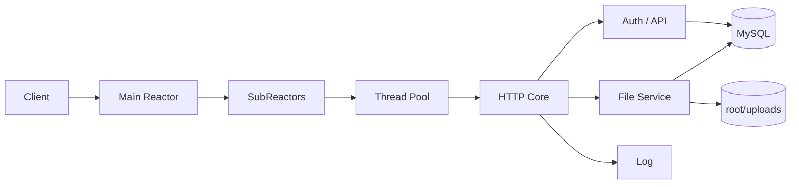

# Atlas WebServer


Atlas WebServer 是一个基于 C++、Linux `epoll`、线程池和 MySQL 的 HTTP/1.1 文件服务项目。当前代码已经从传统教学 CGI 示例扩展为一个带账号体系、Bearer Token 会话、私有文件管理、公开分享、操作审计、冒烟测试、parser 单测和 sanitizer CI 的完整工程。

## 当前能力

| 维度 | 代码实现 |
| --- | --- |
| 网络模型 | 主 Reactor 接收连接，多个 SubReactor 处理连接事件，线程池执行业务任务 |
| HTTP 协议 | HTTP/1.1、Keep-Alive、静态资源、JSON API、`multipart/form-data`、`Transfer-Encoding: chunked`、可选 HTTPS |
| 认证会话 | 注册、登录、PBKDF2 密码存储、Bearer Token、单用户新登录吊销旧 Token、当前/全部会话注销 |
| 文件服务 | 私有文件列表、上传、下载、软删除、恢复、公开/取消公开、公开文件详情和下载 |
| 上传链路 | Content-Length 请求体和 chunked 请求体；multipart body 支持流式临时文件落盘，避免大文件整体进内存 |
| 可观测性 | 访问/操作日志、健康检查、benchmark CSV、invalid gate、wrk 原始输出、容器 stats 采样 |
| 工程化 | Docker Compose、配置文件 + 环境变量覆盖、shell 冒烟测试、C++ parser 单测、ASan/UBSan 构建与 CI |

历史教学路由 `/0`、`/1`、`/2CGISQL.cgi`、`/3CGISQL.cgi`、`/5`、`/6`、`/7` 默认关闭；只有显式开启 `legacy_compat` / `TWS_LEGACY_COMPAT=1` 才恢复。

## 快速开始

推荐用 Docker Compose 启动 Web + MySQL：

```bash
docker compose up -d --build
curl -i http://127.0.0.1:9006/healthz
```

默认服务地址：

| 服务 | 地址 |
| --- | --- |
| Web | `http://127.0.0.1:9006` |
| MySQL | `127.0.0.1:3307` |

停止：

```bash
docker compose down
```

本地编译需要 Linux、`g++`、`make`、`default-libmysqlclient-dev` / `libmysqlclient`、`libssl-dev` / OpenSSL，并准备可访问的 MySQL 8 数据库：

```bash
make server
./server
```

默认读取 `server.conf`，环境变量会覆盖配置文件。Docker Compose 已默认注入 MySQL 连接参数。

## 常用入口

| 类型 | 路径 |
| --- | --- |
| 首页 | `GET /` |
| 账号页面 | `GET /login`、`GET /register` |
| 文件页面 | `GET /files`、`GET /share` |
| 媒体页面 | `GET /media`、`GET /media/photo`、`GET /media/video` |
| 健康检查 | `GET /healthz`、`HEAD /healthz` |
| API | `POST /api/...`、`GET /api/private/...`、`GET /api/files/public...` |

## API 概览

通用约定：

- Base URL：`http://127.0.0.1:9006`
- JSON 请求使用 `Content-Type: application/json`
- 私有接口使用 `Authorization: Bearer <token>`
- 成功响应通常包含 `"code":0`
- 错误响应通常为 `{"code":<http_status>,"message":"..."}`

主要接口：

| 分组 | 接口 |
| --- | --- |
| 健康检查 | `GET /healthz` |
| 调试回显 | `POST /api/echo` |
| 认证 | `POST /api/register`、`POST /api/login` |
| 会话 | `GET /api/private/ping`、`POST /api/private/logout` |
| 操作日志 | `GET /api/private/operations`、`DELETE /api/private/operations/:id` |
| 私有文件 | `GET /api/private/files`、`POST /api/private/files`、`GET /api/private/files/:id/download` |
| 文件管理 | `DELETE /api/private/files/:id`、`POST /api/private/files/:id/restore`、`POST /api/private/files/:id/visibility` |
| 公开文件 | `GET /api/files/public`、`GET /api/files/public/:id`、`GET /api/files/public/:id/download` |

完整字段和响应示例见 [docs/api.md](docs/api.md)。

### 认证示例

```bash
curl -sS -X POST http://127.0.0.1:9006/api/register \
  -H 'Content-Type: application/json' \
  -d '{"username":"demo","passwd":"123456"}'

LOGIN_RESPONSE="$(curl -sS -X POST http://127.0.0.1:9006/api/login \
  -H 'Content-Type: application/json' \
  -d '{"username":"demo","passwd":"123456"}')"
TOKEN="$(printf '%s\n' "$LOGIN_RESPONSE" | sed -n 's/.*"token":"\([^"]*\)".*/\1/p')"

curl -sS http://127.0.0.1:9006/api/private/ping \
  -H "Authorization: Bearer $TOKEN"
```

### 文件上传示例

主上传路径是 `multipart/form-data`：

```bash
curl -sS -X POST http://127.0.0.1:9006/api/private/files \
  -H "Authorization: Bearer $TOKEN" \
  -H 'Expect:' \
  -F 'file=@README.md;type=text/markdown' \
  -F 'filename=README.md' \
  -F 'is_public=false'
```

HTTP parser 也支持 `Transfer-Encoding: chunked`。仓库里的 `scripts/test_chunked_api.sh` 使用 raw socket 发送真实 chunked 请求，覆盖 `/api/echo` 和 multipart 文件上传。

## 架构



核心流程：

1. `main.cpp` 读取 `server.conf`，再应用环境变量和命令行覆盖。
2. `webserver.cpp` 初始化日志、TLS、MySQL 连接池、线程池和监听 socket。
3. 主 Reactor 接收连接，按轮询分配到 SubReactor。
4. `http/core/io.cpp` 负责 socket / TLS 读写与 ring buffer。
5. `http/core/parser.cpp` 解析请求行、Header、Content-Length body 和 chunked body。
6. `http/core/router.cpp` 分发静态资源、认证接口、文件接口和公开文件接口。
7. `http/files/file_service.cpp` 处理上传临时文件、元数据入库、下载、回收站和公开分享。

更多细节见 [docs/architecture.md](docs/architecture.md) 和 [docs/request-sequence.md](docs/request-sequence.md)。

## 目录结构

```text
.
|-- main.cpp                     # 程序入口、daemon supervisor、信号处理
|-- webserver.cpp                # 服务初始化、主 Reactor、连接分发
|-- webserver_sub_reactor.cpp    # SubReactor 事件循环
|-- config.cpp / config.h        # 配置文件、环境变量、命令行解析
|-- server.conf                  # 默认配置
|-- http/
|   |-- core/                    # HTTP parser、router、IO、response、runtime
|   |-- api/                     # 认证、会话、操作日志
|   `-- files/                   # 文件存储、上传解析、公开分享
|-- CGImysql/                    # MySQL 连接池
|-- threadpool/                  # 动态线程池与任务队列
|-- timer/                       # 连接超时管理
|-- log/                         # 同步/异步日志
|-- root/                        # 前端页面、静态资源、上传目录
|-- scripts/                     # 冒烟测试、API 测试、benchmark、perf 脚本
|-- tests/                       # C++ parser 单测
|-- docs/                        # 架构、API、benchmark 和 perf 文档
|-- docker/                      # Docker 辅助文件与 MySQL 初始化 SQL
`-- .github/workflows/           # CI：parser + ASan/UBSan + chunked API 集成
```

## 配置

默认配置在 `server.conf`。环境变量优先级高于配置文件，命令行参数可覆盖部分基础项，随后环境变量会再次生效。

| 配置项 | 环境变量 | 默认值 | 说明 |
| --- | --- | --- | --- |
| `port` | `TWS_PORT` | `9006` | Web 监听端口 |
| `log_write` | `TWS_LOG_WRITE` | `1` | `0` 同步日志，`1` 异步日志 |
| `log_level` | `TWS_LOG_LEVEL` | `1` | 日志级别 |
| `trig_mode` | `TWS_TRIG_MODE` | `3` | epoll 模式，默认 listen ET + conn ET |
| `opt_linger` | `TWS_OPT_LINGER` | `0` | socket linger 策略 |
| `sql_num` | `TWS_SQL_NUM` | `8` | MySQL 连接池大小 |
| `thread_num` | `TWS_THREAD_NUM` | `8` | 基础工作线程数 / SubReactor 数 |
| `threadpool_max_threads` | `TWS_THREADPOOL_MAX_THREADS` | `8` | 线程池最大线程数 |
| `threadpool_idle_timeout` | `TWS_THREADPOOL_IDLE_TIMEOUT` | `30` | 动态线程空闲回收秒数 |
| `threadpool_queue_mode` | `TWS_THREADPOOL_QUEUE_MODE` | `mutex` | 任务队列实现，支持 `mutex` / `lockfree` |
| `mysql_idle_timeout` | `TWS_MYSQL_IDLE_TIMEOUT` | `60` | MySQL 连接空闲检查 |
| `upload_max_bytes` | `TWS_UPLOAD_MAX_BYTES` | `104857600` | 单文件上传上限，默认 100 MiB |
| `conn_timeout` | `TWS_CONN_TIMEOUT` | `15` | HTTP 连接空闲超时 |
| `close_log` | `TWS_CLOSE_LOG` | `0` | `1` 关闭日志 |
| `daemon_mode` | `TWS_DAEMON_MODE` | `0` | daemon supervisor 模式 |
| `pid_file` | `TWS_PID_FILE` | `./atlas-webserver.pid` | daemon pid 文件 |
| `https_enable` | `TWS_HTTPS_ENABLE` | `0` | 开启 HTTPS |
| `https_cert_file` | `TWS_HTTPS_CERT_FILE` | `./certs/server.crt` | TLS 证书 |
| `https_key_file` | `TWS_HTTPS_KEY_FILE` | `./certs/server.key` | TLS 私钥 |
| `legacy_compat` | `TWS_LEGACY_COMPAT` | `0` | 开启教学遗留路由和兼容上传 |
| `db_host` | `TWS_DB_HOST` | `127.0.0.1` | MySQL host |
| `db_port` | `TWS_DB_PORT` | `3306` | MySQL port |
| `db_user` | `TWS_DB_USER` | `root` | MySQL 用户 |
| `db_password` | `TWS_DB_PASSWORD` | 空 | MySQL 密码，生产环境建议只用环境变量 |
| `db_name` | `TWS_DB_NAME` | `qgydb` | MySQL 数据库 |

如果前面使用 Nginx 反向代理，`client_max_body_size` 应不小于 `upload_max_bytes` / `TWS_UPLOAD_MAX_BYTES`。示例见 [deploy/nginx/atlas-webserver.conf.example](deploy/nginx/atlas-webserver.conf.example)。

## 构建与测试

| 命令 | 说明 |
| --- | --- |
| `make server` | 构建普通服务端二进制 |
| `make server-sanitize` | 构建 ASan/UBSan 服务端二进制 |
| `make test-parser` | 运行 C++ parser 单测 |
| `make test-parser-sanitize` | 在 ASan/UBSan 下运行 parser 单测 |
| `scripts/run_smoke_suite.sh` | 运行认证、私有接口、文件、chunked API 冒烟测试 |
| `scripts/test_chunked_api.sh` | 发送真实 chunked 请求，验证 echo 和 multipart 上传 |
| `scripts/run_benchmark_suite.sh` | 执行 wrk benchmark 并生成 CSV / gate 文件 |
| `make clean` | 清理构建产物 |

CI 工作流位于 `.github/workflows/ci.yml`，会执行：

1. `make test-parser-sanitize`
2. `make server-sanitize`
3. 初始化 MySQL schema
4. 启动 ASan/UBSan server
5. 运行 `scripts/test_chunked_api.sh`
6. 检查 server 日志中是否出现 AddressSanitizer / UBSan 错误

## Benchmark 与发布口径

仓库不在 README 发布未经 gate 校验的 headline 性能数字。`scripts/run_benchmark_suite.sh` 会为每个 case 生成：

- `*.wrk.txt`：wrk 原始输出
- `*.stats.csv`：Web / MySQL 容器 CPU、内存采样
- `*.gate.txt`：有效性判定明细
- `results.csv`：结构化结果，包含 `valid` 和 `invalid_reason`

一个 benchmark case 只有同时满足以下条件才视为有效：

- wrk `Socket errors` 总数为 `0`
- Web / MySQL 容器 `RestartCount` 压测前后不增长
- 压测窗口内 Web 日志没有 `server received SIGSEGV`

当前仓库里的历史数据和图表用于开发机观察与瓶颈定位，不作为正式发布基准。完整说明见 [docs/benchmark.md](docs/benchmark.md)、[docs/benchmark.csv](docs/benchmark.csv) 和 [docs/perf-flamegraph.md](docs/perf-flamegraph.md)。

## 数据与存储

Docker 初始化 SQL 位于 `docker/mysql/init.sql`，主要表包括：

| 表 | 说明 |
| --- | --- |
| `user` | 用户与密码哈希 |
| `user_sessions` | Bearer Token 会话 |
| `files` | 文件元数据、公开状态、软删除状态、SHA-256 |
| `operation_logs` | 登录、上传、删除等操作记录 |

上传文件默认存储在 `root/uploads/`，该目录在 Docker Compose 中挂载到宿主机。

## 安全与限制

- 默认关闭 HTTPS；生产环境需配置 `https_enable=1`、证书和私钥。
- 数据库密码、Token 相关配置应通过环境变量注入，不建议写入仓库配置文件。
- 默认主上传路径只接受 `multipart/form-data`；兼容 JSON/base64 上传仅在 `legacy_compat=1` 时启用。
- 当前 parser 支持 chunked request body，但响应仍使用 `Content-Length`。
- 默认单文件上传上限为 100 MiB，可用 `TWS_UPLOAD_MAX_BYTES` 调整。

## 文档索引

| 文档 | 内容 |
| --- | --- |
| [docs/api.md](docs/api.md) | API 字段、参数和响应示例 |
| [docs/architecture.md](docs/architecture.md) | 架构说明 |
| [docs/request-sequence.md](docs/request-sequence.md) | 请求处理时序 |
| [docs/file-module.md](docs/file-module.md) | 文件模块设计 |
| [docs/benchmark.md](docs/benchmark.md) | benchmark 报告和发布口径 |
| [docs/perf-flamegraph.md](docs/perf-flamegraph.md) | perf / FlameGraph 指南 |

## License

MIT License. See [LICENSE](LICENSE).
