# Atlas WebServer

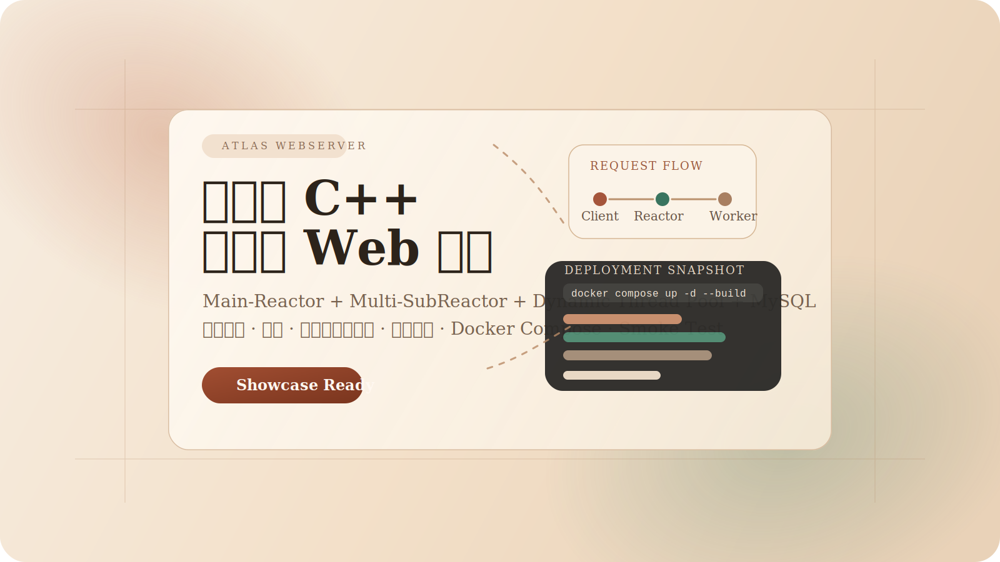


一个基于 C++ / Linux / `epoll` 的工程化 Web 服务项目。

这是一个独立设计并实现的 C++ Web 服务项目，重点补齐了 `Main-Reactor + Multi-SubReactor`、线程池、连接池、超时治理、TLS、文件业务模块、鉴权、操作审计、Docker Compose、压测材料和成体系的 smoke test，适合作为秋招服务端 / C++ 后端 / Linux 网络编程项目展示。

## 仓库速览

- 项目定位：面向秋招展示的 C++ 服务端工程项目，不是只停留在教学 Demo 层面的网络程序
- 技术关键词：`epoll`、Reactor、非阻塞 IO、线程池、MySQL 连接池、TLS、Docker Compose、`wrk`
- 业务闭环：注册登录、Token 鉴权、小文件上传下载、权限控制、操作日志
- 工程闭环：文档、压测、Smoke Test、部署脚本、可直接运行的前端演示页

## 快速导航

- 在线入口说明：[部署与运行](#部署与运行)
- 架构设计：[整体架构](#整体架构)
- 文件业务：[文件业务模块](#文件业务模块)
- 压测结果：[压测结果](#压测结果)
- 文档汇总：[文档索引](#文档索引)
- 发布说明：[RELEASE_NOTES.md](RELEASE_NOTES.md)

## 亮点摘要

- 将早期单体式 HTTP 处理逻辑拆分为 `parser / io / response / runtime / auth / file-service / utils` 七类职责模块，降低单文件复杂度并提升业务扩展性
- 基于 `Main-Reactor + Multi-SubReactor + Dynamic Thread Pool` 构建并发处理模型，配合最小堆超时回收完成连接资源治理
- 引入 MySQL 会话持久化、文件元数据和操作审计，使项目从“网络程序 Demo”升级为“带真实业务闭环的服务端项目”
- 补齐 Docker Compose、健康检查、Smoke Test、分层压测矩阵和结构化文档，形成“可运行、可验证、可讲解”的展示闭环

## 最近精进

- 将 HTTP 层目录进一步按子域收敛为 `http/core`、`http/api`、`http/files`，让连接编排、鉴权接口和文件业务的职责边界更稳定
- 文件业务补齐公开文件列表、公开下载、私有可见范围切换和操作审计，形成“上传 - 分享 - 下载 - 删除 - 追踪”的完整闭环
- 文件下载链路补充 UTF-8 文件名兼容与历史元数据兜底，减少中文文件名和旧记录下载时的类型错配问题
- 前端页面统一为产品化表达，清理展示页口吻，保留统一视觉风格，并把文件页状态提示、空态和操作反馈一起规范化
- 登录态从 `localStorage` 收敛为 `sessionStorage`，避免同一浏览器新开标签页自动复用账号，交互更符合控制台场景
- 上传样例支持直接作为轻量 HTML 用户文档分发，继续保持单文件体积低于 `64 KB`

---

## 目录

- [项目概览](#项目概览)
- [核心亮点](#核心亮点)
- [效果预览](#效果预览)
- [整体架构](#整体架构)
- [模块设计](#模块设计)
- [请求处理链路](#请求处理链路)
- [文件业务模块](#文件业务模块)
- [并发模型与资源治理](#并发模型与资源治理)
- [部署与运行](#部署与运行)
- [接口与页面](#接口与页面)
- [测试与验证](#测试与验证)
- [压测结果](#压测结果)
- [项目结构](#项目结构)
- [文档索引](#文档索引)
- [简历写法](#简历写法)
- [后续演进方向](#后续演进方向)

---

## 项目概览

### 这是一个什么项目

- 一个运行在 Linux 上的 C++ 高并发 Web 服务
- 基于 `epoll` 的 Reactor 网络模型
- 支持 HTTP/1.1、Keep-Alive、静态资源、基础 API、中间件链和 HTTPS
- 内置一个完整的小文件业务闭环：用户注册登录、文件上传下载、权限控制、操作日志
- 已补充 Docker 化部署、健康检查、压测结果、架构图、时序图和脚本化验证

### 适合展示什么能力

- Linux 网络编程：`socket`、`epoll`、非阻塞 IO、ET / LT、`sendfile`
- C++ 服务端基础设施：线程池、连接池、日志系统、定时器、配置化
- 服务端工程化能力：鉴权、错误处理、部署、验证脚本、文档沉淀
- 代码重构能力：将早期臃肿的 HTTP 处理逻辑按职责拆分为独立模块

---

## 核心亮点

- 从教学型单体 HTTP 处理逻辑，重构为分层模块化结构
- 将 Reactor 模型升级为 `Main-Reactor + Multi-SubReactor`
- 将请求处理链拆为 `parser / io / response / runtime / auth / file-service / utils`
- 支持 MySQL 持久化会话、文件元数据、操作审计
- 支持 Bearer Token 鉴权和 `/api/private/*` 私有接口保护
- 明文静态文件支持 `sendfile`，HTTPS 自动切换 `SSL_read / SSL_write`
- 使用最小堆定时器回收超时连接
- Docker Compose 可直接拉起 `web + mysql`
- 具备分层 smoke test：`auth`、`private-api`、`files`
- 提供分层压测矩阵、原始 `wrk` 输出、性能对比结论、架构图和时序图

---

## 效果预览

### 功能闭环


### 工程闭环


---

## 整体架构

### 1. 系统总览

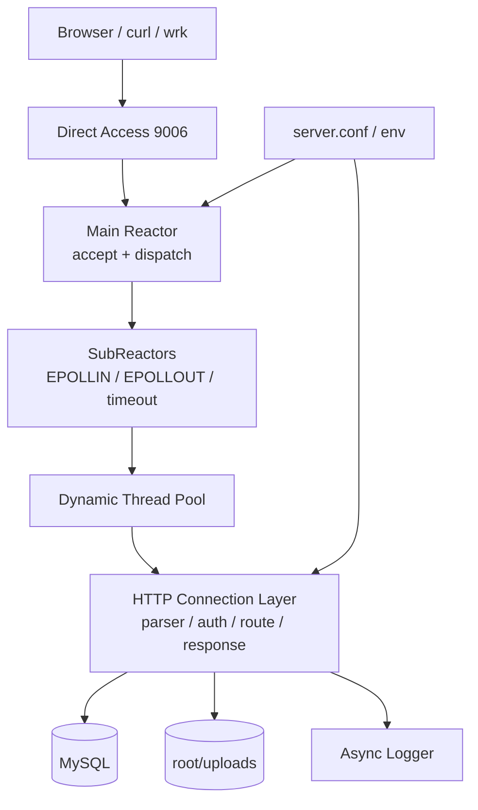

### 2. 启动流程


### 3. 部署形态

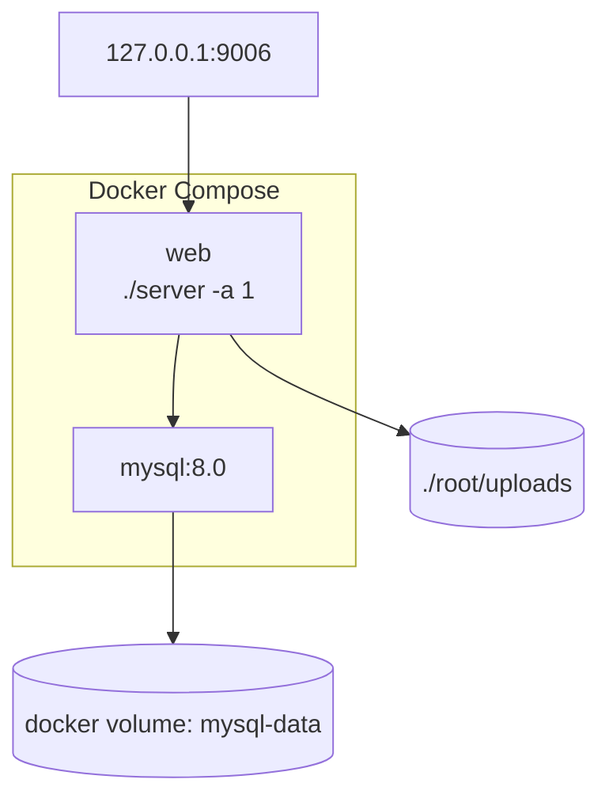

---

## 模块设计

### 当前 HTTP 模块拆分

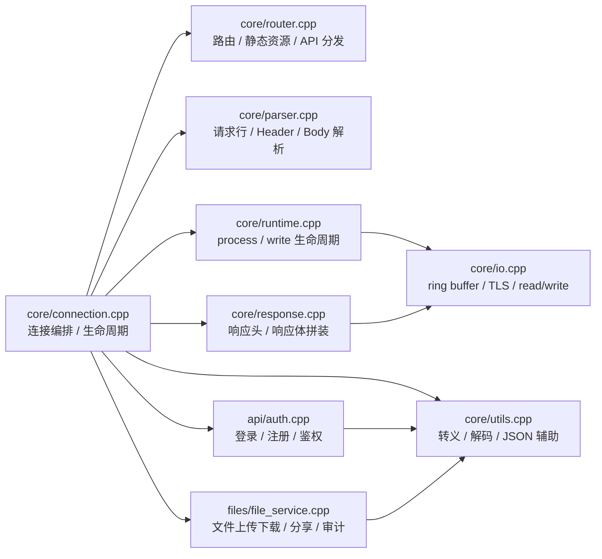

### 模块职责说明

| 模块 | 职责 |
| --- | --- |
| `http/core/connection.cpp` | 请求编排、连接状态维护、核心入口 |
| `http/core/router.cpp` | 路由分发、静态资源入口、API 映射 |
| `http/core/parser.cpp` | 请求行、请求头、请求体、JSON / 表单 / multipart 解析 |
| `http/core/io.cpp` | 环形缓冲区、socket 收发、TLS 握手、ET 模式读写 |
| `http/core/response.cpp` | HTTP 响应格式拼装、错误响应构造 |
| `http/core/runtime.cpp` | `process()` 和 `write()` 生命周期调度 |
| `http/api/auth.cpp` | 注册、登录、会话持久化、Bearer Token 校验 |
| `http/api/auth_session.cpp` | 会话恢复、私有接口鉴权中间层 |
| `http/api/operation_service.cpp` | 操作日志查询与删除 |
| `http/files/file_service.cpp` | 文件上传、列表、公开区、下载、删除、可见范围切换 |
| `http/files/file_helpers.cpp` | 文件名清洗、下载名编码、磁盘路径辅助 |
| `http/core/utils.cpp` | URL 解码、SQL 转义、JSON 转义、Base64 解码 |

### 其他基础设施模块

| 目录 | 作用 |
| --- | --- |
| `threadpool/` | 动态线程池，支持扩容和空闲回收 |
| `timer/` | 最小堆定时器，处理连接超时 |
| `CGImysql/` | MySQL 连接池和 RAII 封装 |
| `log/` | 同步 / 异步日志、日志切分 |
| `memorypool/` | 内存池 |
| `root/` | 页面资源和上传目录 |

---

## 请求处理链路

### 1. 通用请求链路

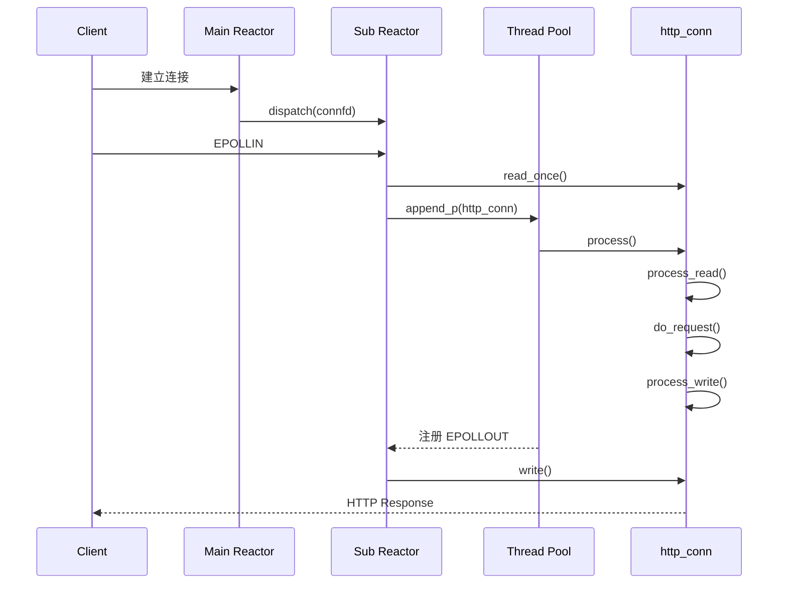

### 2. 登录链路

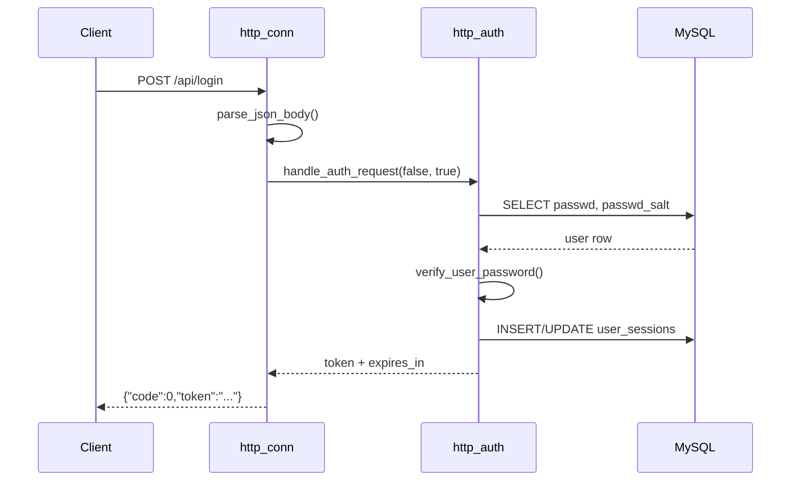

### 3. 文件上传链路

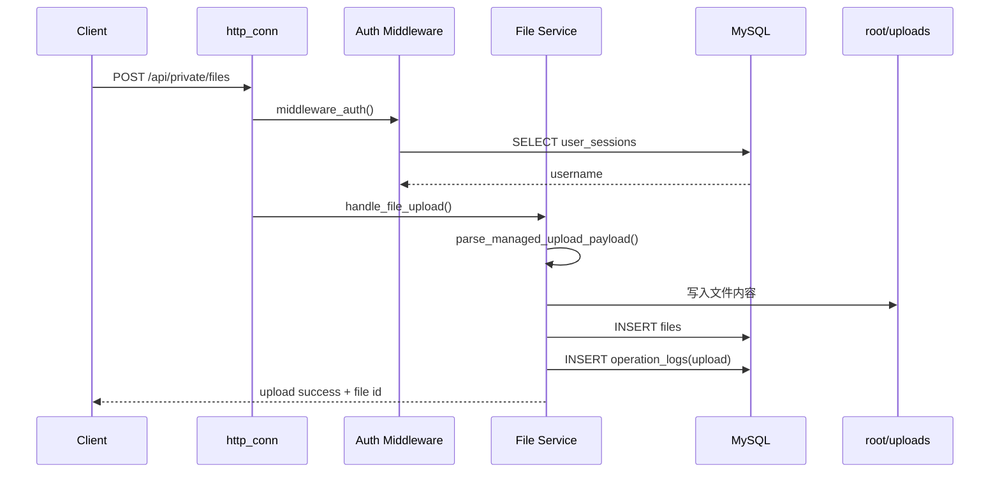

### 4. 文件下载链路

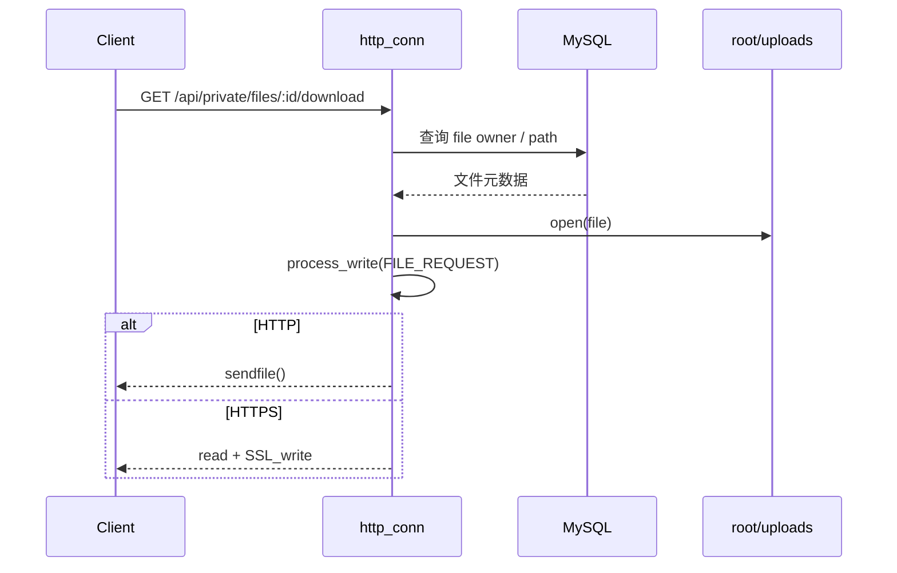

### 5. 超时回收链路

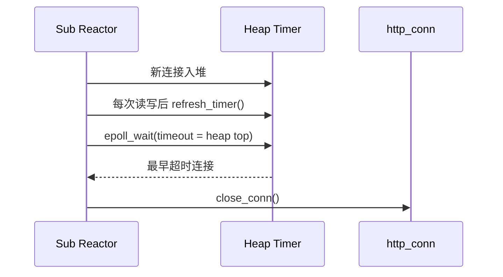

---

## 文件业务模块

### 业务能力

- 用户注册 / 登录
- Bearer Token 私有接口鉴权
- 小文件上传
- 文件列表
- 文件下载
- 文件删除
- 操作日志审计

### 业务数据模型

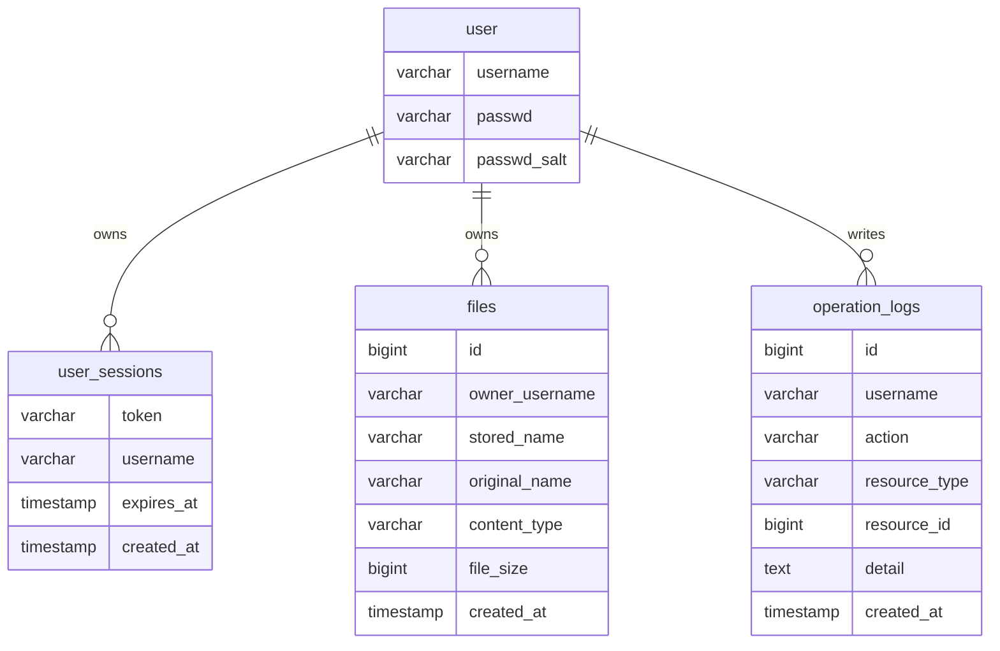

### 存储策略

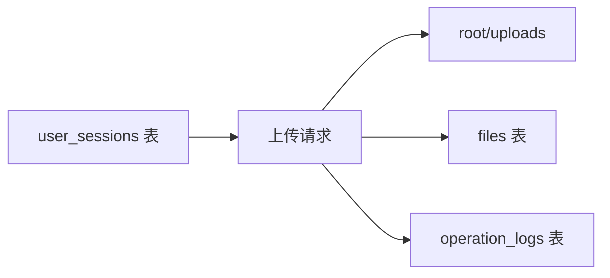

### 当前约束

- 当前展示方案只保留 `64 KB` 以内小文件上传
- 上传内容通过 JSON 中的 `content_base64` 字段传输
- 目标是展示业务闭环和服务端能力，不是大文件传输系统

详细说明见 [docs/file-module.md](docs/file-module.md)。

---

## 并发模型与资源治理

### Reactor 模型

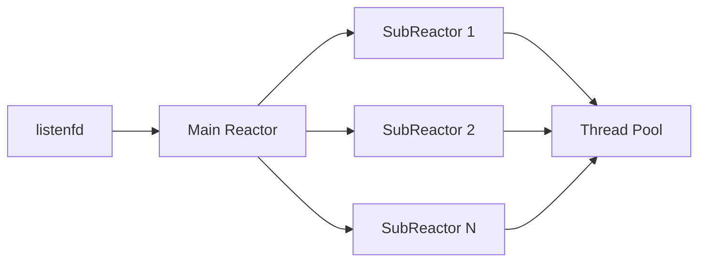

### 线程池策略

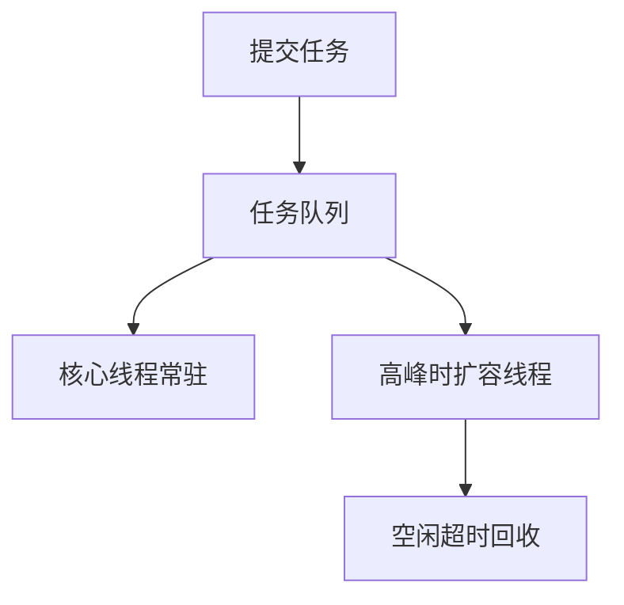

### 连接池策略

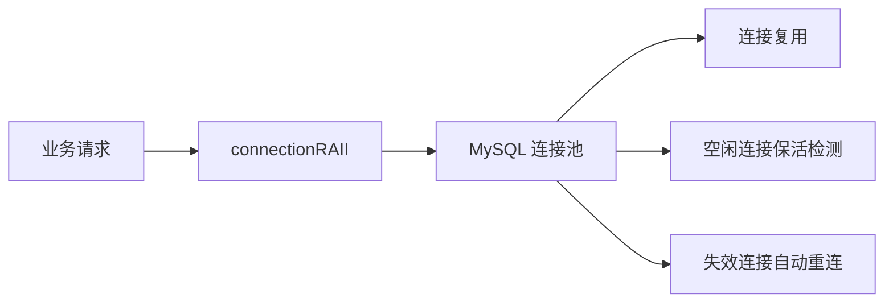

### 超时治理策略

| 能力 | 做法 |
| --- | --- |
| 空闲连接回收 | 最小堆定时器 |
| 连接活跃刷新 | 每次成功读写后刷新过期时间 |
| 长连接支持 | HTTP/1.1 Keep-Alive |
| ET 读写边界 | 一次性读到 `EAGAIN` |
| HTTPS 兼容 | TLS 握手状态推进，按事件切换读写兴趣 |

---

## 部署与运行

### 1. Docker Compose 启动

```bash
docker compose up -d --build
```

启动后默认服务：

- Web: `http://127.0.0.1:9006/`
- MySQL: `127.0.0.1:3307`

### 2. 快速验证

```bash
curl -I http://127.0.0.1:9006/
curl http://127.0.0.1:9006/healthz
```

### 3. 本地编译

确保安装：

- `g++`
- `libmysqlclient`
- `openssl`

然后执行：

```bash
make server
./server
```

### 4. 配置项

项目默认会自动读取 [server.conf](server.conf)，不再要求显式传 `-f server.conf`。

配置优先级：

1. 代码默认值
2. `server.conf`
3. 环境变量
4. 命令行参数

推荐做法：

- 本地开发：直接维护 `server.conf`
- Docker / 部署环境：使用环境变量覆盖敏感项
- 临时调试：只对少量参数使用命令行覆盖

环境变量模板见 [.env.example](.env.example)。

常用配置如下：

```ini
port=9006
log_write=1
log_level=1
log_split_lines=800000
log_queue_size=800
trig_mode=3
sql_num=8
thread_num=8
threadpool_max_threads=16
threadpool_idle_timeout=30
mysql_idle_timeout=60
conn_timeout=15
actor_model=0
daemon_mode=0
https_enable=0
auth_token=
db_host=127.0.0.1
db_port=3306
db_user=root
db_password=
db_name=qgydb
```

常用环境变量如下：

```bash
TWS_PORT=9006
TWS_DB_HOST=127.0.0.1
TWS_DB_PORT=3306
TWS_DB_USER=root
TWS_DB_PASSWORD=your-password
TWS_DB_NAME=qgydb
TWS_AUTH_TOKEN=your-secret-token
TWS_THREAD_NUM=8
TWS_SQL_NUM=8
```

### 5. 守护进程与控制脚本

```bash
./server_ctl.sh start
./server_ctl.sh stop
./server_ctl.sh restart
./server_ctl.sh reload
./server_ctl.sh status
```

### 6. HTTPS

生成自签名证书：

```bash
mkdir -p certs
openssl req -x509 -nodes -newkey rsa:2048 \
  -keyout certs/server.key \
  -out certs/server.crt \
  -days 365 \
  -subj "/CN=localhost"
```

配置：

```ini
https_enable=1
https_cert_file=./certs/server.crt
https_key_file=./certs/server.key
```

验证：

```bash
curl -k https://127.0.0.1:9006/
```

---

## 接口与页面

### 页面入口

- `/`
- `/index.html`
- `/register.html`
- `/login.html`
- `/log.html`
- `/welcome.html`
- `/files.html`

### 主要接口

| 方法 | 路径 | 说明 |
| --- | --- | --- |
| `GET` | `/healthz` | 健康检查 |
| `POST` | `/api/register` | 用户注册 |
| `POST` | `/api/login` | 登录并返回 token |
| `GET` | `/api/private/ping` | 私有鉴权接口 |
| `POST` | `/api/private/logout` | 退出登录 |
| `POST` | `/api/private/files` | 上传小文件 |
| `GET` | `/api/private/files` | 当前用户文件列表 |
| `POST` | `/api/private/files/:id/visibility` | 切换文件公开范围 |
| `GET` | `/api/private/files/:id/download` | 下载文件 |
| `DELETE` | `/api/private/files/:id` | 删除文件 |
| `GET` | `/api/files/public` | 公开文件列表 |
| `GET` | `/api/files/public/:id/download` | 公开文件下载 |
| `GET` | `/api/private/operations` | 查询最近操作日志 |
| `DELETE` | `/api/private/operations/:id` | 删除操作日志 |

### 接口示例

登录：

```bash
curl -X POST http://127.0.0.1:9006/api/login \
  -H "Content-Type: application/json" \
  -d '{"username":"test","passwd":"123456"}'
```

私有接口：

```bash
curl http://127.0.0.1:9006/api/private/ping \
  -H "Authorization: Bearer <token>"
```

上传小文件：

```bash
curl -X POST http://127.0.0.1:9006/api/private/files \
  -H "Authorization: Bearer <token>" \
  -H "Content-Type: application/json" \
  -d '{"filename":"demo.txt","content_base64":"...","content_type":"text/plain"}'
```

---

## 测试与验证

### Smoke Test 体系

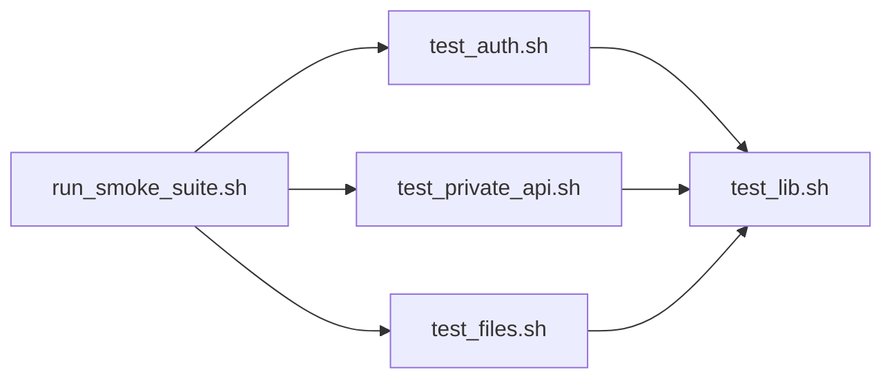

### 脚本说明

| 脚本 | 说明 |
| --- | --- |
| [scripts/run_smoke_suite.sh](scripts/run_smoke_suite.sh) | 一键跑完整 smoke suite |
| [scripts/test_auth.sh](scripts/test_auth.sh) | 注册、登录、私有鉴权、退出 |
| [scripts/test_private_api.sh](scripts/test_private_api.sh) | 私有接口和操作日志 |
| [scripts/test_files.sh](scripts/test_files.sh) | 文件上传、列表、下载、删除 |
| [scripts/test_lib.sh](scripts/test_lib.sh) | 共享 curl / token / 文件辅助函数 |

### 运行方式

```bash
scripts/run_smoke_suite.sh
```

### 验证覆盖点

- 服务启动与健康检查
- 用户注册 / 登录
- Token 生成与私有接口访问
- 文件上传 / 私有列表 / 公开列表 / 下载 / 删除 / 可见范围切换
- 操作日志写入
- 退出登录

---

## 压测结果

### 压测环境

- 服务运行方式：`docker compose up -d`
- 工具：`wrk`
- 压测时长：`10s`
- 线程数：`4`
- HTTPS：关闭
- 目标接口：`/healthz`、`/`、`/api/login`、`/api/private/ping`、`/api/private/files`
- 发布配置：`TWS_LOG_WRITE=0`

说明：

- 当前机器上，同步日志模式比默认异步日志模式表现更好，因此这里展示的是当前仓库在这台机器上的“最佳可复现配置”。
- 完整矩阵和原始 `wrk` 输出见 [docs/benchmark.md](docs/benchmark.md)。

### 核心矩阵

#### 轻接口与静态资源

| 接口 | 并发 | Avg | P90 | P99 | Requests/sec | Socket errors |
| --- | ---: | --- | --- | --- | ---: | --- |
| `/healthz` | 100 | 30.97ms | 24.90ms | 710.15ms | 6898.92 | connect 0, read 0, write 0, timeout 4 |
| `/healthz` | 500 | 101.19ms | 139.49ms | 915.19ms | 4476.61 | connect 0, read 4059, write 8, timeout 214 |
| `/healthz` | 1000 | 132.18ms | 157.00ms | 425.25ms | 7581.63 | connect 0, read 3577, write 0, timeout 6 |
| `/` | 100 | 26.04ms | 30.56ms | 209.02ms | 5165.27 | 无 |
| `/` | 500 | 112.57ms | 147.78ms | 815.33ms | 4851.51 | connect 0, read 586, write 0, timeout 40 |
| `/` | 1000 | 149.16ms | 192.63ms | 313.45ms | 6610.76 | connect 0, read 3218, write 0, timeout 17 |

#### 鉴权与文件查询

| 接口 | 并发 | Avg | P90 | P99 | Requests/sec | Socket errors |
| --- | ---: | --- | --- | --- | ---: | --- |
| `/api/private/ping` | 100 | 15.70ms | 23.92ms | 60.52ms | 6654.09 | 无 |
| `/api/private/ping` | 500 | 59.62ms | 74.79ms | 596.27ms | 5077.29 | connect 0, read 8476, write 1345, timeout 292 |
| `/api/private/ping` | 1000 | 133.55ms | 173.25ms | 364.37ms | 7497.74 | connect 0, read 3489, write 0, timeout 1 |
| `/api/private/files` | 100 | 55.96ms | 84.00ms | 573.09ms | 2196.76 | connect 0, read 0, write 0, timeout 3 |
| `/api/private/files` | 500 | 214.94ms | 293.53ms | 597.87ms | 2173.21 | connect 0, read 731, write 0, timeout 60 |
| `/api/private/files` | 1000 | 285.23ms | 410.50ms | 930.34ms | 3127.67 | connect 0, read 3145, write 40, timeout 179 |

#### 重业务写路径

| 接口 | 并发 | Avg | P90 | P99 | Requests/sec | Socket errors |
| --- | ---: | --- | --- | --- | ---: | --- |
| `/api/login` | 100 | 117.69ms | 159.00ms | 295.95ms | 875.10 | 无 |
| `/api/login` | 500 | 1.08s | 1.43s | 1.84s | 426.50 | connect 0, read 337, write 2, timeout 31 |
| `/api/private/files` `POST` | 100 | 300.48ms | 382.70ms | 697.62ms | 330.92 | 无 |
| `/api/private/files` `POST` | 500 | 1.41s | 1.65s | 1.84s | 320.38 | connect 0, read 586, write 0, timeout 74 |

### 结果解读

- `/healthz`、首页静态页和 `/api/private/ping` 在这套配置下都能跑到 `5k~7.5k req/s` 量级，说明连接接入、静态资源和轻量鉴权路径都具备不错的吞吐能力。
- `/api/private/files` 明显更受 MySQL 影响，在 `500~1000` 并发区间已经持续出现 `read/timeout` 错误，说明数据库查询和返回 JSON 已经成为主要热点。
- `POST /api/login` 和 `POST /api/private/files` 是当前最重的两条写路径，尤其上传接口在 `500` 并发下进入秒级延迟区，后续优化优先级应高于继续拉高轻接口 QPS。
- 额外做了同步/异步日志对比：在这台机器上 `TWS_LOG_WRITE=0` 明显优于默认异步日志模式，因此发布数据采用同步日志配置。

### 文档与原始数据

- 原始数据：[docs/benchmark.csv](docs/benchmark.csv)
- 详细报告：[docs/benchmark.md](docs/benchmark.md)

---

## 项目结构

```text
.
├── CGImysql/                 # MySQL 连接池
├── certs/                    # HTTPS 证书
├── docs/                     # 架构、时序、压测文档
├── http/                     # HTTP 模块拆分目录
│   ├── api/
│   │   ├── auth.cpp
│   │   ├── auth_session.cpp
│   │   ├── auth_state.cpp
│   │   ├── auth_state.h
│   │   └── operation_service.cpp
│   ├── core/
│   │   ├── connection.cpp
│   │   ├── connection.h
│   │   ├── io.cpp
│   │   ├── parser.cpp
│   │   ├── response.cpp
│   │   ├── ring_buffer.h
│   │   ├── router.cpp
│   │   ├── runtime.cpp
│   │   └── utils.cpp
│   └── files/
│       ├── file_helpers.cpp
│       ├── file_helpers.h
│       ├── file_service.cpp
│       ├── file_store.cpp
│       ├── file_store.h
│       └── file_types.h
├── lock/                     # 同步原语封装
├── log/                      # 日志系统
├── memorypool/               # 内存池
├── root/                     # 页面资源、产品化静态页与上传目录
├── scripts/                  # smoke test 脚本
├── test_pressure/            # wrk 压测脚本
├── threadpool/               # 动态线程池
├── timer/                    # 最小堆 / 链表定时器
├── docker-compose.yml
├── Dockerfile
├── main.cpp
├── server.conf
├── server_ctl.sh
├── webserver.cpp
└── webserver.h
```

---

## 文档索引

- 架构图：[docs/architecture.md](docs/architecture.md)
- 静态架构总览图：[docs/architecture-overview.svg](docs/architecture-overview.svg)
- 请求时序图：[docs/request-sequence.md](docs/request-sequence.md)
- 文件业务说明：[docs/file-module.md](docs/file-module.md)
- 压测报告：[docs/benchmark.md](docs/benchmark.md)

---

## 简历写法

### 一句话版本

基于 C++ / Linux / `epoll` 独立实现工程化 Web 服务，采用 `Main-Reactor + Multi-SubReactor` 架构，补齐鉴权、文件业务、MySQL 持久化、超时治理、Docker 部署、Smoke Test 与 `wrk` 压测验证。

### 中文简介版本

Atlas WebServer 是一个我独立设计并持续重构的 C++ 服务端项目。项目基于 Linux `epoll` 和 Reactor 模型实现高并发 Web 服务，并在网络通信能力之外，进一步补齐了用户注册登录、Bearer Token 鉴权、小文件上传下载、权限控制、操作日志、Docker Compose 部署、Smoke Test 和分层压测材料，用于展示我在 Linux 网络编程、服务端架构设计和工程化落地方面的完整能力。

### 项目描述版本

- 基于 `epoll`、非阻塞 socket 和 Reactor 模型独立实现 Linux 高并发 Web 服务，采用 `Main-Reactor + Multi-SubReactor + ThreadPool` 并发处理架构，支持 HTTP/1.1、Keep-Alive、静态资源和基础 API。
- 将 HTTP 层重构为 `parser / io / response / runtime / auth / file-service / utils` 多模块结构，降低单文件耦合度，提升请求解析、路由分发和业务扩展的可维护性。
- 设计并实现注册登录、Bearer Token 鉴权、会话持久化、小文件上传下载、权限控制和操作审计等完整业务闭环，文件元数据和用户会话落库到 MySQL。
- 引入最小堆连接超时治理、MySQL 连接池、Docker Compose、健康检查、Smoke Test 与 `wrk` 分层压测矩阵，形成从开发、部署到验证的工程闭环。

### 简历精简版

- 基于 `epoll` 设计并实现 C++ Web 服务，采用 `Main-Reactor + Multi-SubReactor + ThreadPool` 并发模型，支持 HTTP/1.1、Keep-Alive 和静态资源访问。
- 将 HTTP 请求处理拆分为解析、IO、响应、运行时调度、鉴权、文件服务等模块，提升代码可维护性与业务扩展能力。
- 基于 MySQL 连接池实现注册登录、Bearer Token 鉴权、会话持久化、文件元数据管理和操作审计，完成小文件上传/列表/下载/删除业务闭环。
- 引入最小堆定时器管理空闲连接超时，并补充 Docker Compose、健康检查、Smoke Test 与 `wrk` 压测材料，形成完整工程闭环。

### 面试建议讲法

优先按下面顺序讲：

1. 这个项目解决了哪些真实的服务端工程问题
2. Reactor / 线程池 / 连接池 / 定时器是怎么协作的
3. 文件业务闭环是怎么接入现有 HTTP 框架的
4. 为什么要重构 `http_conn.cpp`，最后怎么按职责拆分
5. 如何验证重构后没有回归：smoke test + 压测材料

### 面试亮点提纲

- 可以重点讲“为什么从单体 HTTP 处理类拆到多模块”，这能体现你对可维护性和边界设计的理解
- 可以重点讲 Reactor、线程池、连接池、定时器之间的协作路径，而不是只背定义
- 可以重点讲文件业务接入后的变化：项目从静态资源服务升级成了有真实权限和数据流转的业务系统
- 可以重点讲压测和验证材料，说明你不仅写了代码，还验证了吞吐、延迟和错误情况
- 可以重点讲配置、部署、日志、健康检查这些工程细节，这些往往比“写了多少算法”更像真实后端项目

---

## 后续演进方向

- 更完整的 HTTP/1.1 语义支持
- 更严格的配置校验与配置热更新
- 指标监控与 Prometheus 接入
- 更正式的单元测试 / 集成测试
- HTTP/2 / gRPC 等协议扩展
- 大文件分片上传方案
- 更细粒度的 RBAC 权限控制

---

## License

本项目为独立开发的 C++ Web 服务项目，用于展示 Linux 网络编程、服务端工程化实现和完整业务闭环设计能力。
