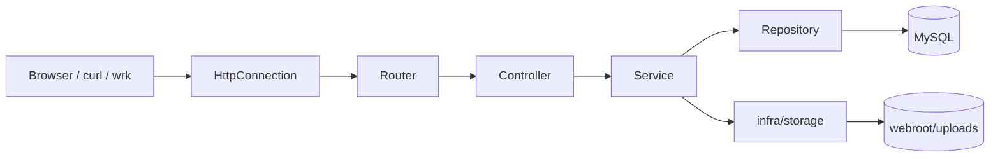

# Atlas WebServer


Atlas WebServer 是一个面向学习、面试展示和小型网盘场景的 C++ Linux WebServer。项目从传统 `epoll + 线程池 + MySQL` 服务器演进为带有账号体系、Bearer Token 会话、文件网盘、公开分享、上传配额、操作审计、数据库迁移、单测、Sanitizer CI 和 benchmark 工具链的完整工程。

项目保留底层网络编程能力：非阻塞 socket、ET/LT 触发模式、主从 Reactor、动态线程池、HTTP/1.1 parser、chunked 请求体、multipart 流式上传、OpenSSL TLS、MySQL C API；同时也在持续工程化重构：HTTP 层已拆出 `controller / service / repository / infra` 分层，避免业务逻辑继续堆进 `HttpConnection`。

## 功能概览

| 模块 | 能力 |
| --- | --- |
| 网络模型 | 主 Reactor accept，多个 SubReactor 处理连接事件，线程池执行业务任务 |
| HTTP 协议 | HTTP/1.1、Keep-Alive、静态资源、JSON API、HEAD/OPTIONS、可选 HTTPS |
| 请求体解析 | `application/json`、`x-www-form-urlencoded`、`multipart/form-data`、`Transfer-Encoding: chunked` |
| 认证会话 | 注册、登录、PBKDF2-HMAC-SHA256 密码存储、Bearer Token、滑动过期、注销当前/全部会话 |
| 文件网盘 | 目录列表、创建/删除空目录、上传、列表、下载、软删除、恢复、公开/取消公开 |
| 上传治理 | 单文件大小限制、用户总容量限制、上传前 preflight 校验、临时文件落盘、SHA-256 去重 |
| 分享能力 | 公开文件列表、公开下载、带 token 的分享链接、访问码、过期时间、下载次数限制 |
| 审计日志 | 登录、上传、下载、删除、恢复、分享、鉴权失败等操作日志 |
| 工程化 | CMake、Docker Compose、数据库迁移、单元测试、覆盖率、clang-format、ASan/UBSan CI |
| 性能工具 | wrk 压测脚本、benchmark CSV、容器 stats 采样、perf flamegraph 文档 |

历史教学路由 `/0`、`/1`、`/2CGISQL.cgi`、`/3CGISQL.cgi`、`/5`、`/6`、`/7` 默认关闭；只有设置 `legacy_compat=1` 或 `TWS_LEGACY_COMPAT=1` 才启用。

## 快速开始

### Docker Compose 推荐路径

```bash
docker compose up -d --build
curl -i http://127.0.0.1:9006/healthz
```

默认端口：

| 服务 | 地址 |
| --- | --- |
| Web | `http://127.0.0.1:9006` |
| MySQL | `127.0.0.1:3307` |

Web 容器启动前会执行 `scripts/migrate_db.sh`，自动应用 `migrations/` 下的 SQL。首次启动会初始化 MySQL schema 和默认测试账号。

停止服务：

```bash
docker compose down
```

清理数据库卷：

```bash
docker compose down -v
```

### 本地构建

依赖：Linux、CMake 3.16+、支持 C++14 的 `g++`、OpenSSL dev、MySQL client dev。

```bash
./build.sh
./build/server
```

本地直连 MySQL 时，先配置环境变量并执行迁移：

```bash
TWS_DB_HOST=127.0.0.1 \
TWS_DB_PORT=3306 \
TWS_DB_USER=root \
TWS_DB_PASSWORD=your_password \
TWS_DB_NAME=qgydb \
./scripts/migrate_db.sh
```

## 5 分钟主链路

```bash
BASE_URL=http://127.0.0.1:9006
USER_NAME=demo
PASSWORD=123456

curl -sS -X POST "$BASE_URL/api/register" \
  -H 'Content-Type: application/json' \
  -d "{\"username\":\"$USER_NAME\",\"passwd\":\"$PASSWORD\"}"

LOGIN_JSON="$(curl -sS -X POST "$BASE_URL/api/login" \
  -H 'Content-Type: application/json' \
  -d "{\"username\":\"$USER_NAME\",\"passwd\":\"$PASSWORD\"}")"
TOKEN="$(printf '%s' "$LOGIN_JSON" | python3 -c 'import json,sys; print(json.load(sys.stdin)["token"])')"

printf 'hello atlas\n' > /tmp/atlas-demo.txt
FILE_SIZE="$(wc -c < /tmp/atlas-demo.txt | tr -d ' ')"

curl -sS -X POST "$BASE_URL/api/private/files/preflight" \
  -H "Authorization: Bearer $TOKEN" \
  -H 'Content-Type: application/json' \
  -d "{\"size\":$FILE_SIZE,\"folder_id\":0}"

UPLOAD_JSON="$(curl -sS -X POST "$BASE_URL/api/private/files" \
  -H "Authorization: Bearer $TOKEN" \
  -H 'Expect:' \
  -F 'file=@/tmp/atlas-demo.txt;type=text/plain' \
  -F 'filename=atlas-demo.txt' \
  -F 'is_public=false')"
FILE_ID="$(printf '%s' "$UPLOAD_JSON" | python3 -c 'import json,sys; print(json.load(sys.stdin)["file"]["id"])')"

curl -sS "$BASE_URL/api/private/files?limit=10" \
  -H "Authorization: Bearer $TOKEN" | python3 -m json.tool

curl -i -sS "$BASE_URL/api/private/files/$FILE_ID/download" \
  -H "Authorization: Bearer $TOKEN"
```

更完整的现场复现步骤见 [docs/quickstart-5min.md](docs/quickstart-5min.md)。

## API 概览

通用约定：

- Base URL：`http://127.0.0.1:9006`
- 私有接口使用 `Authorization: Bearer <token>`
- JSON 请求使用 `Content-Type: application/json`
- 成功响应通常包含 `"code":0`
- 错误响应通常为 `{ "code": <http_status>, "message": "..." }`

| 分组 | 接口 |
| --- | --- |
| 健康检查 | `GET /healthz`、`HEAD /healthz` |
| 调试 | `POST /api/echo` |
| 认证 | `POST /api/register`、`POST /api/login`、`GET /api/private/ping`、`POST /api/private/logout` |
| 操作日志 | `GET /api/private/operations`、`DELETE /api/private/operations/:id` |
| 私有文件 | `GET /api/private/files`、`POST /api/private/files`、`POST /api/private/files/preflight` |
| 文件管理 | `GET /api/private/files/:id/download`、`DELETE /api/private/files/:id`、`POST /api/private/files/:id/restore`、`POST /api/private/files/:id/visibility` |
| 网盘目录 | `GET /api/drive/items?folder_id=0`、`POST /api/drive/folders`、`DELETE /api/drive/folders/:id` |
| 网盘上传 | `POST /api/drive/files/preflight`、`POST /api/drive/files/upload`、`GET /api/drive/files/:id/download`、`DELETE /api/drive/files/:id` |
| 公开文件 | `GET /api/files/public`、`GET /api/files/public/:id`、`GET /api/files/public/:id/download` |
| 分享链接 | `POST /api/private/files/:id/share`、`GET /api/share/:token`、`GET /api/share/:token/download` |

详细字段、响应示例和错误码见 [docs/api.md](docs/api.md)。文件模块边界见 [docs/file-module.md](docs/file-module.md)。

## 架构分层



| 层级 | 目录 | 职责 |
| --- | --- | --- |
| 启动层 | `app/` | 配置解析、daemon supervisor、WebServer 初始化、Reactor 编排 |
| HTTP Core | `http/core/` | socket IO、HTTP parser、chunked parser、响应写回、连接生命周期 |
| 路由层 | `http/router/` | 静态路由表、API 分发、页面路由、静态资源解析 |
| Controller | `http/controllers/` | 认证、文件、操作日志等 HTTP 入口，负责参数校验和响应适配 |
| HTTP 辅助 | `http/api/`、`http/files/` | 保留兼容入口、multipart 解析、文件下载响应适配 |
| Service | `service/` | 认证、会话、文件、目录、分享、配额等业务编排 |
| Repository | `repo/mysql/` | SQL 访问、结果映射、schema 可用性检查 |
| Infra | `infra/` | MySQL 连接池、存储、线程池、定时器、日志、锁封装 |
| Webroot | `webroot/` | 前端页面、静态资源、上传目录 |

当前已抽出的 controller：

- `AuthController`：登录、注册、登出、`ping`
- `FileController`：文件、网盘目录、公开文件、分享链接
- `OperationController`：操作日志列表和删除

`HttpConnection` 仍保留底层连接状态和少量兼容委托入口。下一步可引入轻量 `HttpRequest` / `HttpResponse` 适配对象，逐步移除 controller 对 `HttpConnection` 的 `friend` 访问。

## 文件与上传设计

- 主上传路径使用 `multipart/form-data`，文件字段名默认 `file`。
- multipart 请求体会先流式写入 `webroot/uploads/.tmp/`，再抽取文件 part，避免大文件整体常驻内存。
- 单文件上限由 `upload_max_bytes` / `TWS_UPLOAD_MAX_BYTES` 控制，默认 `100 MiB`。
- 单用户总容量由 `user_storage_quota_bytes` / `TWS_USER_STORAGE_QUOTA_BYTES` 控制，默认 `1 GiB`，`0` 表示不限制。
- 前端和 API 可先调用 `/api/private/files/preflight` 或 `/api/drive/files/preflight` 做上传前校验。
- 服务端落库前会再次校验配额，防止绕过前端预检。
- 文件内容计算 `SHA-256`，相同内容复用 `physical_files` 物理记录，`files` 表保存用户视角元数据。
- 删除为软删除，进入回收站；恢复时如果同名冲突，会按 `demo (1).txt` 规则重命名。

如果前面有 Nginx 反向代理，`client_max_body_size` 应不小于应用的 `upload_max_bytes`。示例见 [deploy/nginx/atlas-webserver.conf.example](deploy/nginx/atlas-webserver.conf.example)。

## 数据库迁移

项目使用版本化 SQL 管理 schema：

| 文件 | 说明 |
| --- | --- |
| `migrations/001_init_schema.sql` | 初始化完整 schema |
| `migrations/002_upgrade_existing_drive_dedup.sql` | 升级旧文件表到目录 + 去重模型 |
| `docker/mysql/init.sql` | Docker 新数据卷初始化 SQL |
| `scripts/migrate_db.sh` | 本地/容器统一迁移入口 |

迁移记录写入 `schema_migrations`。应用启动阶段只检查 schema 是否可用，不再在 `WebServer` 启动流程里动态拼接 `CREATE TABLE` / `ALTER TABLE`。详细说明见 [docs/database-migrations.md](docs/database-migrations.md)。

## 配置

默认配置文件为 `server.conf`。环境变量优先级高于配置文件；生产环境建议使用环境变量注入数据库密码和证书路径。

| 配置项 | 环境变量 | 默认值 | 说明 |
| --- | --- | --- | --- |
| `port` | `TWS_PORT` | `9006` | Web 监听端口 |
| `log_write` | `TWS_LOG_WRITE` | `1` | `0` 同步日志，`1` 异步日志 |
| `log_level` | `TWS_LOG_LEVEL` | `1` | 日志级别 |
| `trig_mode` | `TWS_TRIG_MODE` | `3` | epoll 模式，默认 listen ET + conn ET |
| `opt_linger` | `TWS_OPT_LINGER` | `0` | socket linger 策略 |
| `sql_num` | `TWS_SQL_NUM` | `8` | MySQL 连接池大小 |
| `thread_num` | `TWS_THREAD_NUM` | `8` | SubReactor / 基础工作线程数 |
| `threadpool_max_threads` | `TWS_THREADPOOL_MAX_THREADS` | `8` | 动态线程池最大线程数 |
| `threadpool_idle_timeout` | `TWS_THREADPOOL_IDLE_TIMEOUT` | `30` | 动态线程空闲回收秒数 |
| `threadpool_queue_mode` | `TWS_THREADPOOL_QUEUE_MODE` | `mutex` | 队列实现，支持 `mutex` / `lockfree` |
| `mysql_idle_timeout` | `TWS_MYSQL_IDLE_TIMEOUT` | `60` | MySQL 连接空闲检查 |
| `upload_max_bytes` | `TWS_UPLOAD_MAX_BYTES` | `104857600` | 单文件上传上限 |
| `user_storage_quota_bytes` | `TWS_USER_STORAGE_QUOTA_BYTES` | `1073741824` | 单用户总容量上限，`0` 不限制 |
| `conn_timeout` | `TWS_CONN_TIMEOUT` | `15` | HTTP 连接空闲超时 |
| `daemon_mode` | `TWS_DAEMON_MODE` | `0` | daemon supervisor 模式 |
| `pid_file` | `TWS_PID_FILE` | `./atlas-webserver.pid` | daemon pid 文件 |
| `https_enable` | `TWS_HTTPS_ENABLE` | `0` | 是否开启 HTTPS |
| `https_cert_file` | `TWS_HTTPS_CERT_FILE` | `./certs/server.crt` | TLS 证书 |
| `https_key_file` | `TWS_HTTPS_KEY_FILE` | `./certs/server.key` | TLS 私钥 |
| `legacy_compat` | `TWS_LEGACY_COMPAT` | `0` | 是否启用教学遗留路由 |
| `db_host` | `TWS_DB_HOST` | `127.0.0.1` | MySQL host |
| `db_port` | `TWS_DB_PORT` | `3306` | MySQL port |
| `db_user` | `TWS_DB_USER` | `root` | MySQL 用户 |
| `db_password` | `TWS_DB_PASSWORD` | 空 | MySQL 密码 |
| `db_name` | `TWS_DB_NAME` | `qgydb` | MySQL 数据库 |

## 构建、测试与质量检查

| 命令 | 说明 |
| --- | --- |
| `./build.sh` | CMake Release/Debug 构建，输出 `build/server` |
| `cmake -S . -B build && cmake --build build -j` | 手动 CMake 构建 |
| `scripts/run_unit_tests.sh` | CTest 单元测试入口 |
| `scripts/run_coverage.sh` | parser 覆盖率 smoke；安装 `gcovr` 时生成 HTML |
| `scripts/format_check.sh check` | `clang-format` 检查 |
| `scripts/format_check.sh fix` | 自动格式化 C++ 代码 |
| `scripts/migrate_db.sh` | 应用数据库迁移 |
| `scripts/run_smoke_suite.sh` | 认证、私有 API、文件、分享、chunked API 冒烟测试 |
| `scripts/test_chunked_api.sh` | raw socket 发送真实 chunked 请求 |
| `scripts/run_benchmark_suite.sh` | wrk benchmark、CSV、gate 和容器 stats |
| `scripts/profile_perf_flamegraph.sh` | perf + FlameGraph 采样入口 |

CI 位于 `.github/workflows/ci.yml`，覆盖 CMake 构建、CTest、coverage smoke、格式检查、ASan/UBSan parser 测试、数据库迁移和 chunked API 集成测试。

## 目录结构

```text
.
|-- app/                         # main、配置、WebServer、Reactor 启动层
|-- http/
|   |-- core/                    # HttpConnection、parser、IO、response、runtime
|   |-- router/                  # API/页面/静态资源路由
|   |-- controllers/             # Auth/File/Operation controller
|   |-- api/                     # 兼容入口、会话中间件、操作日志 helper
|   `-- files/                   # multipart parser、文件下载响应、文件辅助函数
|-- service/                     # auth/files 业务服务
|-- repo/mysql/                  # Repository / DAO
|-- infra/                       # db、storage、threadpool、timer、log、lock
|-- webroot/                     # 页面、样式、媒体资源、uploads
|-- migrations/                  # 版本化 SQL 迁移
|-- scripts/                     # 测试、迁移、benchmark、coverage、format 脚本
|-- tests/                       # C++ 单元测试
|-- docs/                        # 架构、API、迁移、性能和复现文档
|-- docker/                      # Docker 辅助文件与 MySQL 初始化 SQL
|-- deploy/                      # Nginx 等部署示例
`-- .github/workflows/           # CI
```

更详细的目录说明见 [docs/project-structure.md](docs/project-structure.md)。

## Benchmark 与性能说明

仓库保留 benchmark 工具和历史报告，但 README 不直接宣传未经 gate 校验的 headline 数字。运行：

```bash
scripts/run_benchmark_suite.sh
```

输出包括：

- `*.wrk.txt`：wrk 原始输出
- `*.stats.csv`：Web / MySQL 容器 CPU、内存采样
- `benchmark.csv`：汇总指标
- `benchmark-trusted.csv`：通过 invalid gate 的可信样本

详细方法和解释见 [docs/benchmark.md](docs/benchmark.md)，火焰图流程见 [docs/perf-flamegraph.md](docs/perf-flamegraph.md)。

## 面试讲解要点

- 底层能力：`epoll`、非阻塞 IO、Reactor、线程池、HTTP parser、chunked/multipart、OpenSSL、MySQL C API。
- 工程化能力：CMake、Docker、CI、Sanitizer、coverage、数据库迁移、benchmark gate。
- 安全与可靠性：PBKDF2 密码、Bearer Token 会话、路径/文件名清洗、上传配额、软删除、操作审计。
- 分层重构：`HttpConnection` 逐步收敛为连接和协议层；业务入口已拆到 `AuthController`、`FileController`、`OperationController`；业务编排在 `service/`，SQL 在 `repo/mysql/`。
- 后续改进：引入 `HttpRequest` / `HttpResponse` 适配层移除 controller 的 `friend` 依赖；对 fd、`FILE*`、`MYSQL_RES*`、`SSL*` 做更多 RAII 封装；补齐 controller/service 级单元测试。

## 文档索引

| 文档 | 内容 |
| --- | --- |
| [docs/quickstart-5min.md](docs/quickstart-5min.md) | 5 分钟主链路复现 |
| [docs/api.md](docs/api.md) | API 字段和响应示例 |
| [docs/architecture.md](docs/architecture.md) | 架构设计 |
| [docs/request-sequence.md](docs/request-sequence.md) | 请求时序 |
| [docs/file-module.md](docs/file-module.md) | 文件模块设计 |
| [docs/database-migrations.md](docs/database-migrations.md) | 数据库迁移 |
| [docs/project-structure.md](docs/project-structure.md) | 目录结构 |
| [docs/benchmark.md](docs/benchmark.md) | benchmark 方法 |
| [docs/perf-flamegraph.md](docs/perf-flamegraph.md) | perf flamegraph |

## License

本项目使用 MIT License，详见 [LICENSE](LICENSE)。
