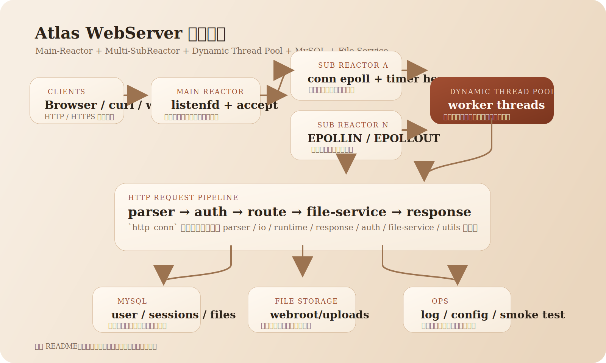
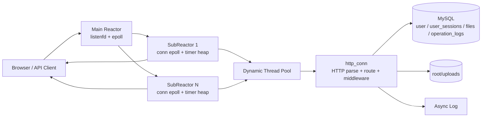
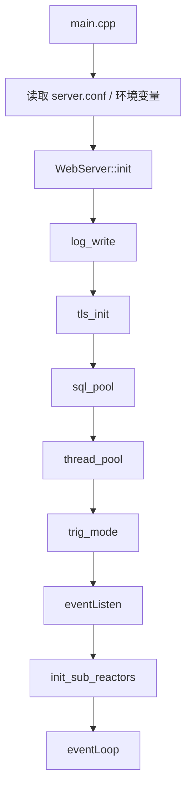
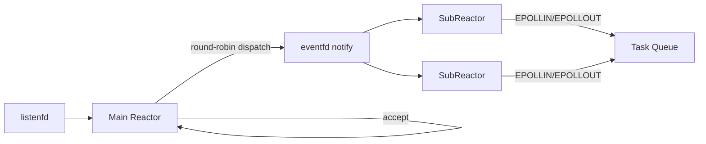
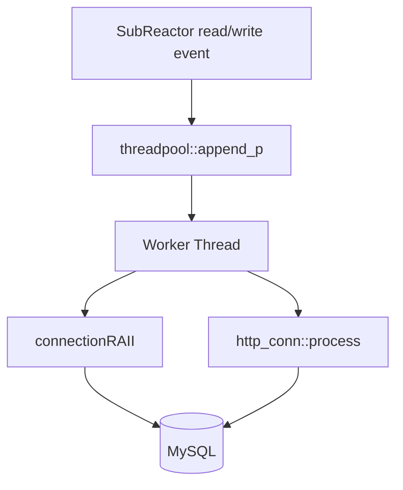
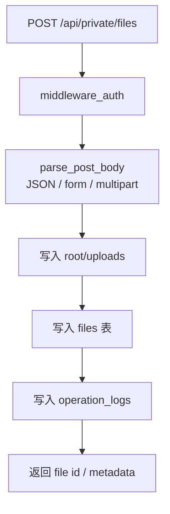
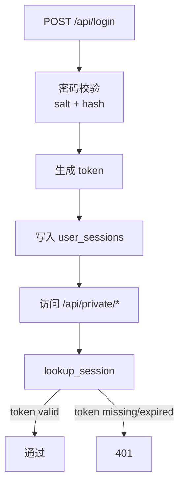

# 架构图

这份文档用于面试和 README 展示，重点说明服务启动、Reactor 协作、线程池执行、数据库与文件模块的关系。

静态 SVG 版本：

## 整体架构

## 启动阶段

说明：

- `main.cpp` 负责组装所有配置并驱动服务启动
- `sql_pool()` 初始化 MySQL 连接池并预加载用户数据
- `thread_pool()` 创建动态线程池
- `eventListen()` 创建监听 socket、主 `epoll` 和 SubReactor

## Reactor 协作模型

说明：

- 主 Reactor 只关心 `listenfd`
- 新连接通过轮询分发到不同 SubReactor
- SubReactor 自己维护连接事件和超时堆
- 业务处理不在 Reactor 线程里执行，而是交给线程池

## 线程池与数据库

说明：

- SubReactor 收到 `EPOLLIN` 后将连接对象投递到线程池
- 工作线程通过 `connectionRAII` 临时获取数据库连接
- `http_conn::process()` 内完成请求解析、鉴权、中间件、路由和响应组装

## 文件服务模块

说明：

- 上传文件内容落盘到 `root/uploads`
- 文件元数据单独写入 `files`
- 上传、下载、删除、登录等行为写入 `operation_logs`

## 鉴权与会话

说明：

- 密码以带盐哈希形式存储
- token 会写入 `user_sessions`
- 私有接口统一通过 `middleware_auth()` 做 Bearer Token 校验

## 超时回收

说明：

- 每次 I/O 后都会刷新连接活跃时间
- SubReactor 周期性扫描最小堆
- 过期连接主动关闭，避免长时间占用 fd 和线程池资源
