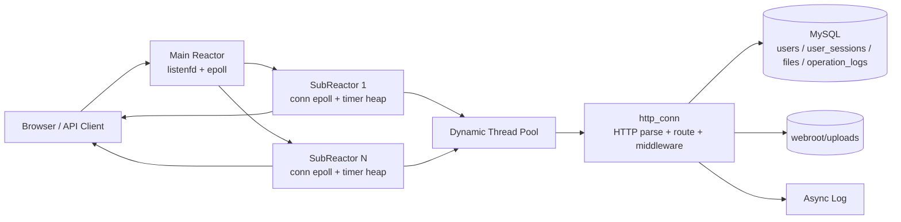
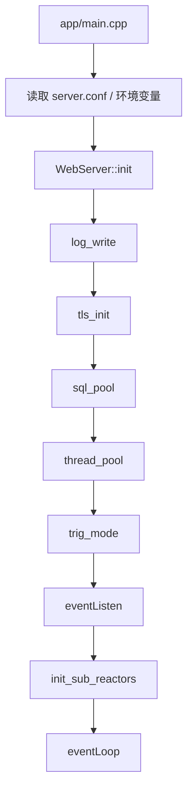
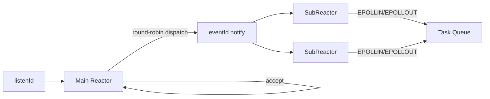
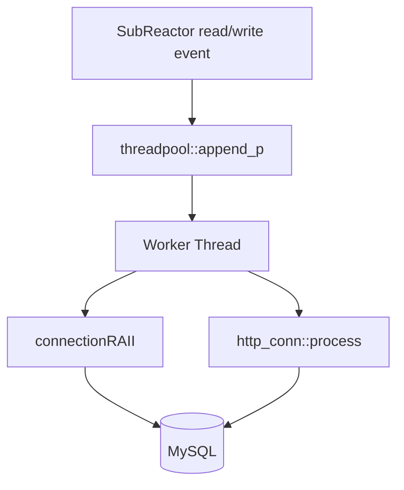
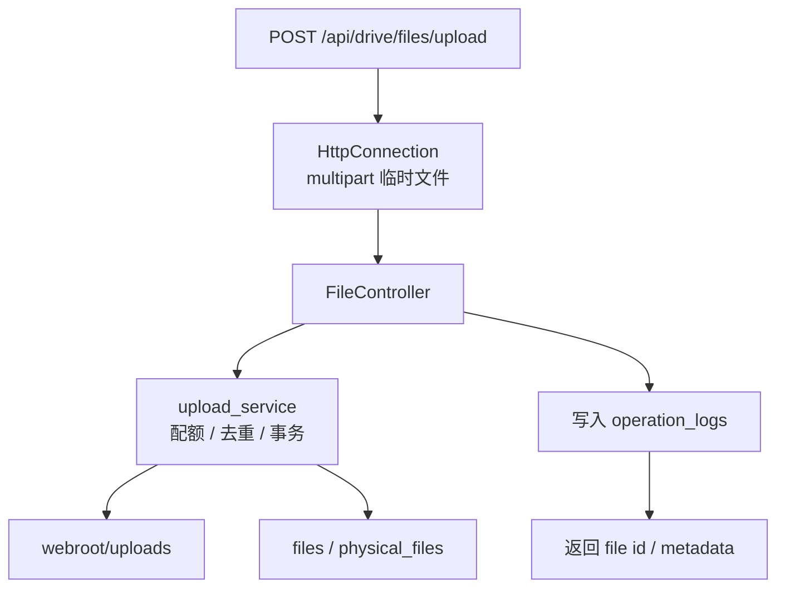
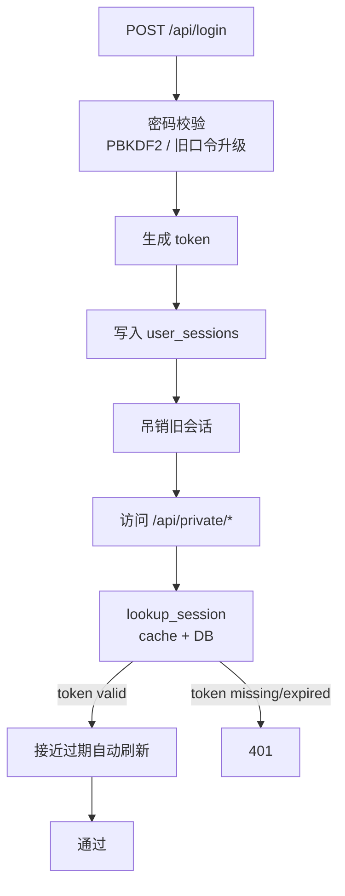
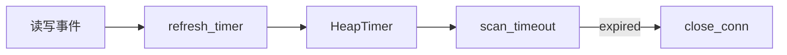

# 架构图

本文档说明服务启动流程、Reactor 协作关系、线程池执行路径以及数据库与文件模块之间的运行时关系。

静态 SVG 版本：

## 整体架构

## 启动阶段

说明：

- `app/main.cpp` 负责组装所有配置并驱动服务启动
- `sql_pool()` 初始化 MySQL 连接池并预加载用户数据
- `thread_pool()` 创建动态线程池
- `eventListen()` 创建监听 socket、主 `epoll` 和 SubReactor

## Reactor 协作模型

说明：

- 主 Reactor 只关心 `listenfd`
- 新连接通过轮询分发到不同 SubReactor
- SubReactor 自己维护连接事件和超时堆
- 业务处理不在 Reactor 线程里执行，而是交给线程池

## 线程池与数据库

说明：

- SubReactor 收到 `EPOLLIN` 后将连接对象投递到线程池
- 工作线程通过 `connectionRAII` 临时获取数据库连接
- `http_conn::process()` 内完成请求解析、鉴权、中间件、路由和响应组装

## 文件服务模块

说明：

- `HttpConnection` 只负责协议解析、multipart 临时文件和响应生命周期
- `upload_service` 在事务内完成用户行锁、容量校验、物理文件去重和逻辑文件插入
- 文件内容最终落盘到 `webroot/uploads`，元数据写入 `files` / `physical_files`
- 上传、下载、删除、登录等行为写入 `operation_logs`

## 鉴权与会话

说明：

- 密码使用 `PBKDF2-HMAC-SHA256` 和安全随机盐存储
- token 会写入 `user_sessions`，并在接近过期时做滑动刷新
- 新登录默认吊销同用户旧会话
- 私有接口统一通过 `middleware_auth()` 做 Bearer Token 校验

## 超时回收

说明：

- 每次 I/O 后都会刷新连接活跃时间
- SubReactor 周期性扫描最小堆
- 过期连接主动关闭，避免长时间占用 fd 和线程池资源
