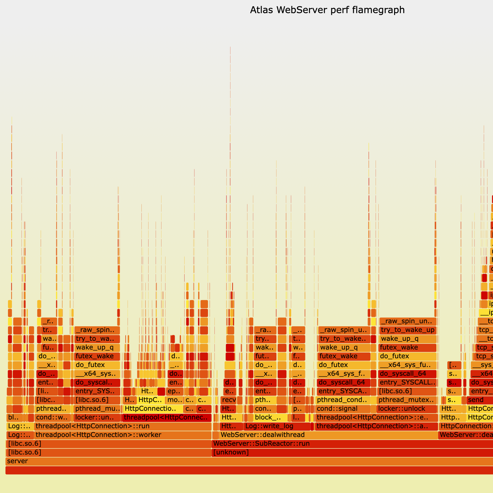

# perf + FlameGraph

这个项目默认运行在 Linux / Docker 环境中，因此在 macOS 上做 `perf + FlameGraph` 时，建议通过 Docker 中的 Linux 内核完成采样，而不是直接在宿主机执行。

## 前提

- Docker / Docker Compose 可用
- `wrk` 已安装
- 服务端可通过 `http://127.0.0.1:9006` 访问

## 一键采样

仓库内提供了 profiling 专用镜像和脚本：

```bash
chmod +x scripts/profile_perf_flamegraph.sh
./scripts/profile_perf_flamegraph.sh
```

默认行为：

- 使用 `docker-compose.yml + docker-compose.perf.yml` 启动带 `perf` 能力的 `web` 服务
- 对容器内 `server` 进程做 `perf record`
- 同时用 `wrk` 压测 `GET /healthz`
- 生成 `perf.data`、折叠栈和 `flamegraph.svg`

默认输出目录：

```text
reports/perf/<timestamp>/
```

## 常用参数

```bash
TARGET_URL=http://127.0.0.1:9006/api/private/ping \
LUA_SCRIPT=./test_pressure/private_ping.lua \
CONNECTIONS=300 \
THREADS=4 \
DURATION=20s \
SAMPLE_FREQ=199 \
./scripts/profile_perf_flamegraph.sh
```

可覆盖参数：

- `BASE_URL`：服务根地址，默认 `http://127.0.0.1:9006`
- `TARGET_URL`：压测目标地址，默认 `/healthz`
- `CONNECTIONS`：`wrk -c`，默认 `200`
- `THREADS`：`wrk -t`，默认 `4`
- `DURATION`：压测和采样时长，默认 `15s`
- `SAMPLE_FREQ`：`perf record -F` 采样频率，默认 `99`
- `LUA_SCRIPT`：可选 `wrk` Lua 脚本
- `STACK_MODE`：调用栈模式，默认 `dwarf`
- `REPORT_DIR`：显式指定输出目录

## 结果文件

- `wrk.txt`：压测原始输出
- `perf-record.txt`：`perf record` 标准输出和错误输出
- `perf.data`：原始采样文件
- `perf.unfolded`：`perf script` 展开栈
- `perf.folded`：折叠后的火焰图输入
- `flamegraph.svg`：最终火焰图

## 示例火焰图

下面这张图来自仓库内保留的一份 `GET /healthz` 采样预览图，场景是默认的 `4` 线程、`200` 连接、`15s` 压测：

- 仓库内预览图：[`reports/perf/previews/healthz_flamegraph.png`](../reports/perf/previews/healthz_flamegraph.png)
- 交互式 SVG：运行采样脚本后在生成目录下查看 `reports/perf/<timestamp>/flamegraph.svg`

GitHub 对带脚本的交互式 SVG 预览支持有限，因此这里默认展示 PNG 预览；如果你需要缩放、搜索和点击查看栈细节，运行脚本后直接打开产物目录中的 `flamegraph.svg`：



## 解读建议

- 横向更宽的函数表示累计 CPU 时间更高，应先排查
- 如果热点集中在 `epoll_wait`、`futex`，说明更多是在等待而不是 CPU 忙
- 如果热点集中在 HTTP 解析、路由、JSON 拼装、文件 I/O、MySQL 调用，则应结合对应接口场景继续拆分
- 建议至少分别对 `GET /healthz`、首页静态资源、登录接口、私有文件列表接口各采一次

## 常见问题

### 1. `perf_event_open` 权限错误

如果 Docker Desktop 的 Linux VM 对性能计数器限制较严，`perf` 可能仍然失败。当前仓库已经在 `docker-compose.perf.yml` 中开启：

- `privileged: true`
- `cap_add: PERFMON/SYS_ADMIN/SYS_PTRACE`
- `seccomp:unconfined`

如果仍失败，通常是 Docker Desktop 内核能力限制，不是项目代码问题。

### 2. `perf not found for kernel ... linuxkit`

Docker Desktop 常见的 Linux 内核版本带有 `linuxkit` 后缀，Ubuntu 自带的 `perf` wrapper 会按当前内核版本查找完全匹配的工具包。仓库脚本已经绕过这个 wrapper，直接定位 `/usr/lib/linux-tools/.../perf` 真实二进制执行采样。

### 3. 火焰图没有业务符号

当前 `makefile` 在 `DEBUG=1` 时使用 `-g` 编译，默认足够支持符号解析。如果你切到 `DEBUG=0`，火焰图会明显变差。

### 4. 为什么不用 macOS 自带采样器

因为这个服务依赖 Linux 的 `epoll` 与容器运行方式，`perf` 更接近目标部署环境；如果只是想看 macOS 本地 CPU 热点，才考虑 `Instruments` / `xctrace`。
