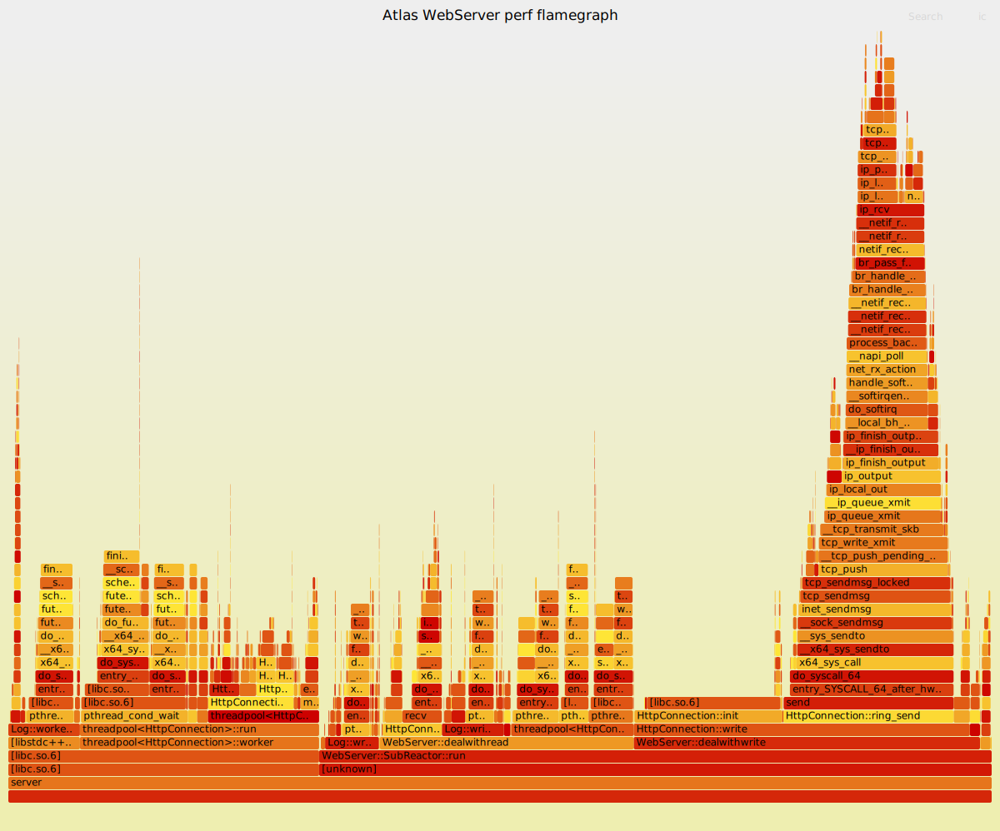

# perf + FlameGraph

## 采样入口

仓库内已经提供了一键脚本：

```bash
chmod +x scripts/profile_perf_flamegraph.sh
./scripts/profile_perf_flamegraph.sh
```

默认会：

- 用 `docker-compose.yml + docker-compose.perf.yml` 启动带 `perf` 能力的 `web` 服务
- 对容器内 `server` 进程执行 `perf record`
- 同时用 `wrk` 压测默认目标 `GET /healthz`
- 生成 `perf.data`、折叠栈和 `flamegraph.svg`

默认输出目录：

```text
reports/perf/<timestamp>/
```

常用参数示例：

```bash
TARGET_URL=http://127.0.0.1:9006/api/private/ping \
LUA_SCRIPT=./test_pressure/private_ping.lua \
CONNECTIONS=300 \
THREADS=4 \
DURATION=20s \
SAMPLE_FREQ=199 \
./scripts/profile_perf_flamegraph.sh
```

建议至少分别对这些场景单独采样一次，而不是只看 `GET /healthz`：

- 健康检查接口
- 登录接口
- 私有文件列表接口

## 数据分析

一次完整的采样结果里，最值得先看的不是 SVG 本身，而是“吞吐、延迟、CPU 热点、等待热点”是否一致。

产物目录中的关键文件：

- `wrk.txt`：压测原始结果，用来确认 QPS、延迟分布、超时或错误情况
- `perf-record.txt`：确认 `perf` 是否真正采到了样本，是否有权限或符号相关警告
- `perf.data`：原始采样数据，后续所有分析都从这里展开
- `perf.unfolded`：展开后的调用栈，便于检查某个热点路径是否合理
- `perf.folded`：火焰图输入，适合快速聚合比较热点占比
- `flamegraph.svg`：最终可视化结果，适合找“最宽的栈”和主调用路径

读数据时建议按这个顺序：

1. 先看 `wrk.txt`，确认当前压测到底是在“CPU 打满”还是“延迟升高但 CPU 不忙”。
2. 再看 `flamegraph.svg`，确认热点是集中在用户态业务逻辑、系统调用，还是线程等待。
3. 最后回到 `perf.unfolded` 或 `perf-record.txt`，验证热点路径是否稳定，避免被一次偶发采样误导。

如果 `wrk` 显示吞吐不高、延迟却明显上升，而火焰图顶部大面积是等待函数，那么问题通常不在“某个纯计算函数太慢”，而在锁竞争、I/O 等待、事件循环空转或下游依赖。

## 结果分析

火焰图里横向越宽，表示累计 CPU 时间越高，优先级通常也越高。但“宽”不等于“一定要优化”，要先判断它是有效工作还是被动等待。

### 1. 热点集中在 `epoll_wait`、`futex`

这类图形通常说明线程大量时间花在等待，而不是执行繁重计算。

常见解释：

- `epoll_wait` 宽：请求量不足、连接空闲较多，或者主线程在等事件
- `futex` 宽：锁竞争、条件变量等待、线程同步开销较大

这类结果不要直接做微优化，应先回答两个问题：

- 当前瓶颈是不是 CPU？如果不是，继续抠函数级 CPU 优化收益很低
- 等待是正常现象还是异常现象？例如健康检查接口本来就可能出现较多等待，不代表程序有问题

### 2. 热点集中在 HTTP 解析、路由分发

这通常说明服务端已经进入请求处理热路径，CPU 确实在忙业务前半段。

应重点检查：

- 请求头和请求行解析是否存在重复扫描
- 路由匹配是否有不必要的字符串比较或拷贝
- 小对象分配是否过于频繁

如果 `GET /healthz` 这类轻接口都在解析阶段出现明显热点，说明基础请求处理链路还有压缩空间。

### 3. 热点集中在 JSON 拼装、字符串处理

这类热点往往意味着响应构造成本偏高，尤其在列表接口、登录返回体、错误响应拼装中常见。

优先关注：

- 是否重复进行字符串拼接
- 是否有可避免的序列化中间态
- 是否因为日志、错误信息、路径拼接引入额外分配

如果火焰图显示热点分散在多个小型字符串函数里，通常说明问题不是单个“大函数”，而是整体对象生命周期和内存分配策略不够紧凑。

### 4. 热点集中在文件 I/O 或 MySQL 调用

这说明瓶颈已经离开纯 Web 层，进入文件访问或数据库交互。

应结合接口类型判断：

- 文件下载热点高：优先检查文件读取、缓存命中、sendfile/零拷贝路径
- 登录接口热点高：优先检查鉴权逻辑、数据库索引、查询次数
- 私有文件列表接口热点高：优先检查分页、目录遍历、SQL 结果集大小、JSON 输出成本

如果图上用户态业务函数不宽，但系统调用或数据库相关路径很宽，下一步更应该补充 I/O 与 SQL 侧指标，而不是继续只看 FlameGraph。

## 改进方向

看到热点后，建议按“先确认瓶颈类别，再做针对性改进”的顺序推进。

### CPU 型热点

适用于热点集中在解析、路由、序列化、字符串处理等用户态函数：

- 减少重复解析和重复拷贝
- 合并小块字符串拼装
- 降低临时对象与内存分配次数
- 复用缓冲区，缩短热点路径中的对象生命周期

这类优化最适合通过“同一接口、同一参数、前后两次 FlameGraph 对比”来验证。

### 等待型热点

适用于热点集中在 `epoll_wait`、`futex`、锁等待、条件变量等待：

- 缩小锁粒度
- 减少共享状态
- 检查线程模型是否引入多余同步
- 区分“正常空闲等待”和“异常竞争等待”

如果等待型热点明显，应该补充并发模型和锁竞争分析，而不是继续只提高 `perf record -F` 采样频率。

### I/O 型热点

适用于文件下载、磁盘访问、数据库交互相关路径：

- 为文件下载增加缓存或更直接的发送路径
- 减少阻塞式文件读取
- 检查 SQL 是否存在重复查询、全表扫描或返回过大结果集
- 将 FlameGraph 与数据库慢查询、接口耗时拆分一起看

这类问题通常需要“接口级 tracing + perf”联合判断，单靠火焰图只能看到 CPU 时间，无法完整解释等待来源。

## 本次真实采样

本次提交保留一张真实采样生成的 SVG，用来固定当前基线。原始 `perf.data` 和中间结果仍放在 `reports/perf/<timestamp>/`，该目录只作为本地临时产物，不提交到仓库。

复现命令：

```bash
DURATION=20s \
CONNECTIONS=200 \
THREADS=4 \
SAMPLE_FREQ=99 \
./scripts/profile_perf_flamegraph.sh
```

采样条件：

| 项目 | 值 |
| --- | --- |
| 采样时间 | 2026-05-15 |
| 压测接口 | `GET /healthz` |
| 目标地址 | `http://127.0.0.1:9006/healthz` |
| 并发连接 | `200` |
| wrk 线程 | `4` |
| 压测时长 | `20s` |
| perf 采样频率 | `99Hz` |
| perf 栈模式 | `dwarf` |
| perf 样本数 | `2788` |
| perf 数据大小 | `22.741 MB` |

压测结果：

| 指标 | 结果 |
| --- | ---: |
| 总请求数 | `426714` |
| 吞吐 | `21291.73 req/s` |
| 平均延迟 | `24.02 ms` |
| P50 | `8.59 ms` |
| P75 | `12.19 ms` |
| P90 | `16.35 ms` |
| P99 | `711.07 ms` |
| 最大延迟 | `1.48 s` |
| wrk timeout | `53` |
| 传输速率 | `3.82 MB/s` |

### 火焰图

下图是本次真实运行生成并提交的 SVG。GitHub 对带脚本的交互式 SVG 预览支持有限；如果要缩放、搜索和点击查看完整栈细节，建议在浏览器中直接打开 `docs/perf-flamegraph.svg`。



### 热点解读

| 热点路径 | 折叠栈占比 | 解读 |
| --- | ---: | --- |
| `SubReactor::run -> dealwithwrite -> HttpConnection::write -> HttpConnection::init` | `12.95%` | 写响应后连接状态重置是本次最宽的单条路径，`/healthz` 的业务逻辑很轻，因此连接生命周期成本会被放大。 |
| `threadpool<HttpConnection>::run -> pthread_cond_wait -> futex_wait -> finish_task_switch` | `3.59%` / `2.98%` | 工作线程存在明显条件变量等待和调度切换，说明同步与唤醒成本在轻接口压测中占比不低。 |
| `Log::worker_loop -> pthread_cond_wait -> futex_wait` | `3.23%` | 日志线程等待在图上可见，配合读路径中的 `Log::write_log` 唤醒，说明日志队列也参与了热路径同步。 |
| `dealwithread -> threadpool::enqueue -> pthread_mutex_lock` | `2.19%` | 读事件进入线程池时有锁竞争或等待，轻请求下线程池投递成本值得关注。 |
| `dealwithread -> Log::write_log -> pthread_cond_signal` | `2.12%` | 每次请求触发日志唤醒会增加 futex wake 和调度开销。 |
| `HttpConnection::write -> ring_send -> send -> tcp_*` | `1.04%` 单条栈，按 children 展开约 `17%` | 响应发送和内核 TCP 栈是主要有效工作之一，属于高并发短响应场景中的合理热点。 |

### 结论

这次 `/healthz` 压测的吞吐达到 `21291.73 req/s`，P50/P90 分别为 `8.59 ms` 和 `16.35 ms`，中位数和常规分位表现正常。但 P99 达到 `711.07 ms`，并出现 `53` 个 wrk timeout，说明在 `200` 并发连接下已经有明显尾延迟。

火焰图没有显示 JSON、SQL、文件 I/O 这类业务热点；主要宽栈集中在响应发送、连接重置、线程池投递、日志唤醒、`futex` 和调度切换。对于 `/healthz` 这种轻接口，当前更值得优先看的不是单个计算函数，而是事件循环到线程池、日志队列以及连接生命周期上的同步成本。

优先改进方向：

- 对 `/healthz` 这类轻量接口评估是否可以减少线程池投递，避免一次短请求经过完整工作线程调度。
- 降低热路径日志成本，例如减少健康检查日志、批量唤醒日志线程或按级别关闭高频访问日志。
- 检查 `HttpConnection::write` 后调用 `HttpConnection::init` 的必要工作量，确认是否存在可延后或可复用的状态重置。
- 观察 `epoll_ctl` 与 `modfd` 调用频率，短连接或高并发短响应下这部分可能进一步影响尾延迟。
- 后续应对登录、私有文件列表、文件下载分别采样；本次结论只代表 `GET /healthz` 的高并发轻接口路径。

## 常见问题

### 1. `perf_event_open` 权限错误

如果 Docker Desktop 的 Linux VM 对性能计数器限制较严，`perf` 可能仍然失败。当前仓库已在 `docker-compose.perf.yml` 中开启：

- `privileged: true`
- `cap_add: PERFMON/SYS_ADMIN/SYS_PTRACE`
- `seccomp:unconfined`

如果仍失败，通常是 Docker Desktop 内核能力限制，不是项目代码问题。

### 2. `perf not found for kernel ... linuxkit`

Docker Desktop 常见的 Linux 内核版本带有 `linuxkit` 后缀。Ubuntu 自带的 `perf` wrapper 会按当前内核版本查找完全匹配的工具包。仓库脚本已经绕过这个 wrapper，直接定位 `/usr/lib/linux-tools/.../perf` 真实二进制执行采样。

### 3. 火焰图没有业务符号

使用 CMake 的 `Debug` 或 `RelWithDebInfo` 构建会包含调试符号，默认足够支持符号解析。如果使用纯 `Release` 且不带调试符号，火焰图可读性会明显变差。

### 4. 为什么不用 macOS 自带采样器

因为这个服务依赖 Linux 的 `epoll` 与容器运行方式，`perf` 更接近目标部署环境；如果只是想看 macOS 本地 CPU 热点，才考虑 `Instruments` / `xctrace`。
