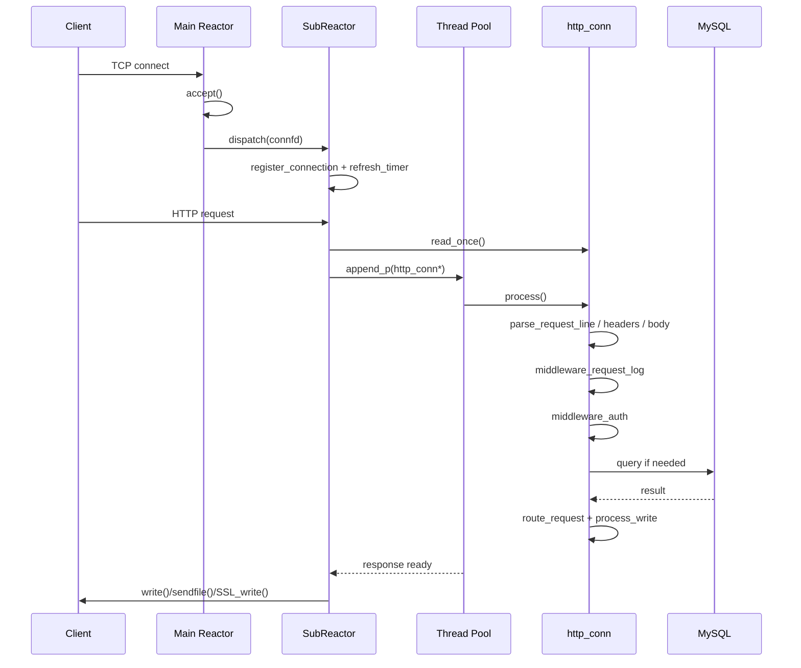
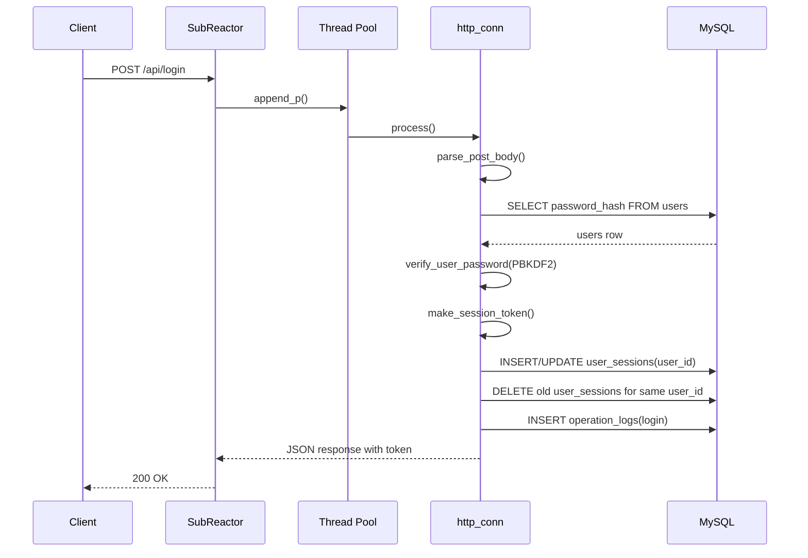
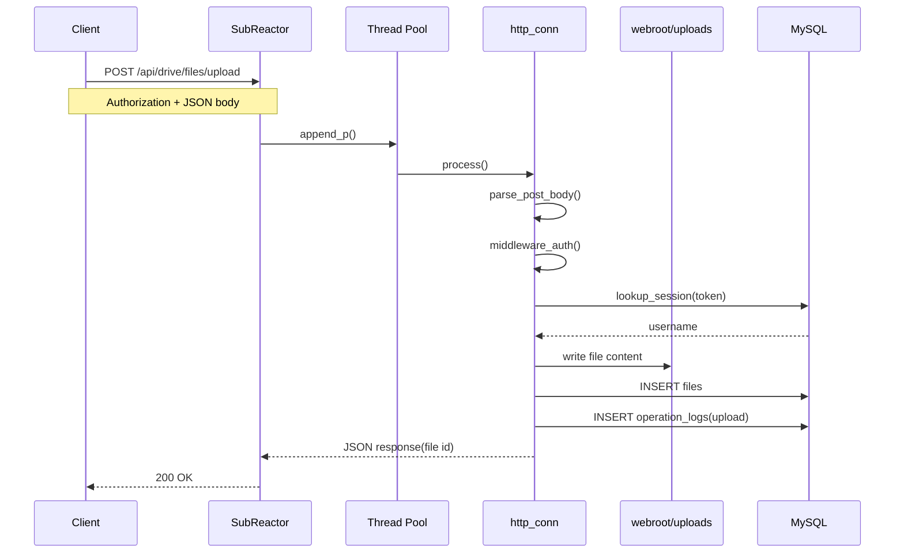
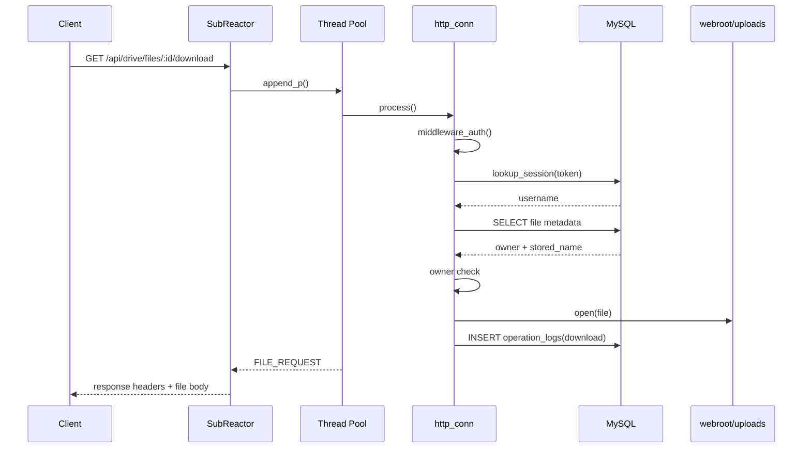
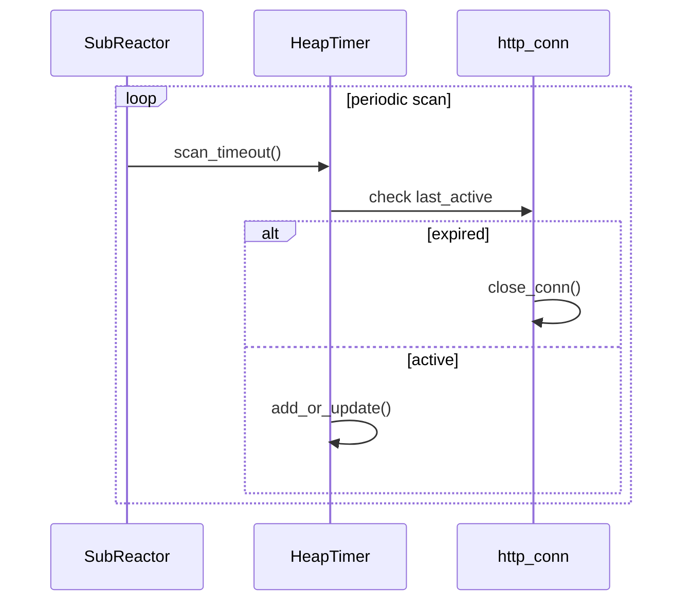

# 请求时序图

这份文档专门描述一次请求是如何从进入监听 socket、到完成鉴权、业务处理、数据库操作、响应返回的。

## 通用请求时序

## 登录请求时序

## 文件上传请求时序

## 文件下载请求时序

## 超时连接回收时序

## 关键说明

- 主 Reactor 只负责接入，不承担业务执行，避免监听线程被耗时逻辑阻塞。
- SubReactor 负责连接级读写事件和超时管理，线程池负责业务解析和数据库访问。
- `http_conn` 是请求处理核心，串联了解析、鉴权、路由、数据库操作和响应拼装。
- 文件服务按“文件内容落磁盘、元数据和审计落 MySQL”的方式拆分。
- 私有接口统一走 `middleware_auth()`，token 先查带过期时间的内存缓存，再回落到 `user_sessions`。
- session 接近过期时会自动刷新，`logout` 支持当前 token 或当前用户全会话失效。
